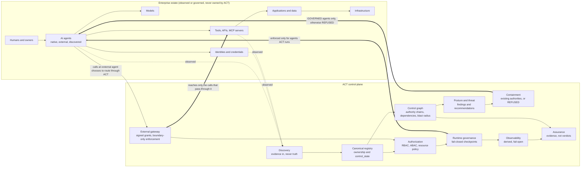

# AI Agent Control Tower

**Know every agent. Know its reach. Know what you can actually control.**

ACT is an enterprise AI control plane for discovering, governing, securing,
observing, and auditing AI agents across an organization. It maps agents to the
humans, identities, models, tools, MCP servers, credentials, data, applications,
policies, and infrastructure they depend on, then distinguishes what the
organization can merely observe from what it can genuinely govern or stop.

**Visibility is not the same as control.** ACT records what it can see, what it
can govern, and what it can enforce as three separate facts. Where it lacks the
authority to act, it says so: a containment request against an agent ACT does
not run returns `REFUSED` with a reason, never a fabricated success.

ACT is an independent engineering and startup project. It is not a finished
commercial product and is not presented as ready for production use. It
contains no employer code, data, or infrastructure.

| | |
|---|---|
| Latest milestone | Milestone 5, Universal Agent Control & Security Fabric, complete on `main` |
| Baseline | commit `9667707` (2026-09-16), migration head `0061_assurance_evidence` |
| Stack | FastAPI, SQLAlchemy, PostgreSQL 17 backend; React 19 + TypeScript console |
| Evidence | Automated engineering proofs on `main`; no production or customer validation |
| Repository record | [REPO_STATE.md](REPO_STATE.md) · [ROADMAP.md](ROADMAP.md) · [CHANGELOG.md](CHANGELOG.md) |

Contents:
[Why ACT exists](#why-act-exists) ·
[Truthful control model](#the-truthful-control-model) ·
[Capabilities](#capabilities) ·
[Conceptual control graph](#conceptual-control-graph) ·
[Architectural principles](#architectural-principles) ·
[What has been demonstrated](#what-has-been-demonstrated) ·
[Repository state](#current-verified-repository-state) ·
[Milestones](#milestones) ·
[Validation status](#validation-status) ·
[Limitations](#limitations-and-what-act-is-not) ·
[Quick start](#quick-start) ·
[Documentation](#documentation)

---

## Why ACT Exists

Enterprises are beginning to operate growing numbers of AI agents across
frameworks, models, tools, applications, identities, APIs, MCP servers,
credentials, and infrastructure. A traditional inventory can tell an
organization that an agent exists. That is not enough.

The harder questions are:

- Who owns this agent?
- Which identity does it execute as?
- Which credentials can it use?
- Which tools and APIs can it invoke?
- Which MCP servers does it depend on?
- Which applications, data, and infrastructure can it reach?
- Which other agents or authority chains extend its effective reach?
- What happens if the agent is compromised, and what is the resulting blast radius?
- Which controls can ACT actually enforce, and which are only advisory or observational?
- What evidence exists for every one of those answers?

ACT is built around answering those questions truthfully. Every answer is
backed by a row, a decision record, or an audited event, and every claim of
control is bounded by the authority ACT actually holds.

---

## The Truthful Control Model

This is ACT's defining design constraint. Discovery, governance, and
enforcement are separate facts, recorded separately, and none of them is
inferred from another.

### Control states

Every agent in ACT's single canonical registry carries a server-authoritative
`control_state`. It answers one question: what can ACT actually do to this
agent?

| State | Meaning | What ACT may do |
|---|---|---|
| `DISCOVERED` | ACT knows the agent exists, usually through a discovery sweep | Record it, map it, raise findings about it. No authority. |
| `CLAIMED` | An authorized person has taken responsibility for it | Ownership is recorded. Still not governed. |
| `REGISTERED` | Brought under ACT's registry and policy scope | Policy evaluation, and gateway grants where configured. |
| `GOVERNED` | ACT has native runtime enforcement authority | Runtime governance and the kill switch apply. In the current implementation, this state is used for agents executed through ACT's native runtime. |

Discovery never implies governance. A client cannot write `control_state`; it
moves only through audited, owner-gated transitions. Details:
[docs/runtime/registry/asset-model.md](docs/runtime/registry/asset-model.md).

### External enforcement modes

For agents ACT did not build and does not run, an enforcement mode states how
far ACT's reach extends. Each mode carries both what ACT does and what it
explicitly cannot do, and both travel together in every API response.

| Mode | ACT does | Enforcement reach | ACT explicitly cannot |
|---|---|---|---|
| `OBSERVED` | Ingests the agent's events as evidence | None | Deny, stop, or constrain anything the agent does |
| `ADVISORY` | Evaluates the real runtime policies and recommends | None | Enforce anything; a recommendation is advice for a human |
| `GATEWAY_ENFORCED` | Authorizes or denies capability calls the agent routes through ACT's gateway | The boundary only | Reach the agent's model calls, its network traffic, or any tool it holds directly |
| `NATIVE_ENFORCED` | Runs the agent | Full: the runtime governance engine and the kill switch | |

In the current implementation, `NATIVE_ENFORCED` is server-derived from
`control_state = GOVERNED` and is not independently writable. A
gateway-enforced external agent stays `REGISTERED`; its only enforcement beyond
a single denied call is revocation of its grant, which ends its access to ACT's
boundary and does not stop the underlying agent.
Details: [docs/bridge/enforcement-modes.md](docs/bridge/enforcement-modes.md).

### Containment and `REFUSED`

Containment maps seven actions (terminate execution, suspend agent, deny tool,
revoke capability, isolate credential, disable integration, require approval)
onto authorities that already exist in the platform. It adds no enforcement of
its own.

For containment actions that require native runtime authority, an agent that
is not `GOVERNED` returns `status: REFUSED` when ACT lacks the required
authority. Nothing is invoked, and the record does not pretend otherwise.
`REFUSED` is not a product
failure. It is the evidence that ACT does not fabricate enforcement authority,
and the Milestone 5 proof asserts it rather than avoiding it. Details:
[docs/threat/truthful-containment.md](docs/threat/truthful-containment.md).

The rule to take away: **visibility is not authority, and authority is not
enforcement.**

---

## Capabilities

The capabilities below are implemented on `main`; major paths are exercised by
the repository's backend and frontend test suites. Vendor breadth is
deliberately narrow; see
[Limitations](#limitations-and-what-act-is-not).

**Estate and control**

- One canonical agent registry describing native, external, and discovered
  agents, with ownership, provenance, and `control_state`.
- Discovery and reconciliation: append-only observations from a source adapter,
  deterministic reconciliation with no silent merge or delete, and staleness
  raised as a finding. One reference HTTP registry adapter ships.
- Agent identity and authority mapping: one machine identity per agent,
  ownership history, and reconstructable human-to-agent-to-tool authority
  chains.
- Relational control graph over identities, agents, tools, MCP servers,
  credentials, connectors, and resources, with dependency and reachability
  queries and blast-radius analysis. Recursive SQL, no graph database.
- MCP servers and tools represented through the existing tool domain, with
  trust status recorded as evidence rather than enforced.
- Security posture rules and shadow-agent findings: deterministic, explainable,
  signals only.
- Runtime threat detection over governance decisions, behavioral findings, and
  tool calls. Detection recommends; an operator confirms.
- Truthful containment routed only through existing authorities, with
  `REFUSED` where authority is absent.
- External governance gateway with HMAC-signed, scoped, expiring, revocable
  grants and database-enforced replay protection.
- Enterprise command center covering estate inventory, shadow agents,
  ownership, identity, the control graph, tools and MCP, posture, threats,
  external platforms, governance coverage, cost exposure, and assurance.
  Affordances are computed from server truth, never guessed in the browser.

**Governed execution**

- Runtime governance checkpoints inside the model-to-tool loop returning
  `ALLOW`, `DENY`, `CHALLENGE`, or `STOP`, failing closed when a mandatory
  checkpoint cannot be evaluated.
- Authorization and permission enforcement through one gateway: RBAC with a
  role hierarchy, ABAC over subject, resource, action, environment, and
  AI-specific attributes, resource ACLs, delegated administration, and identity
  governance (access review campaigns, separation of duties, orphaned
  identities).
- Human approval workflows: risk-scored actions routed to a review workbench
  with approve, reject, escalate, and assign.
- Model and tool gateways: an OpenAI-compatible provider adapter with streaming
  and token accounting, per-organization encrypted credentials, retry and
  circuit breaking, HTTP tools behind an SSRF egress guard, and JSON Schema
  argument validation.
- Deployment and release lifecycle: environments and promotion, a fail-closed
  release gate, weighted traffic allocation, canary, blue-green, recreate, and
  rolling strategies, automated rollback subordinate to the kill switch, a
  Postgres-leased scheduler and worker fleet, and a Release Operations Center.
- Enterprise integration: a connector framework and SDK, four generic
  connectors (REST, database, storage, queue), and OIDC and SAML federation.

**Observability, cost, and assurance**

- Execution tracing derived from domain rows, a trace explorer, and
  OpenTelemetry export to any OTLP collector, fail-open and off the hot path.
- Cost governance with actual, estimated, and unpriced spend kept apart, and
  budgets enforced by reserve-then-reconcile.
- Telemetry privacy and retention: per-scope capture policy defaulting to
  metadata only, secrets scrubbed before persistence, chain-of-thought never
  captured, a distinct audited permission for content, and per-class expiry.
- SLOs, error budgets, and an alert lifecycle that creates signals and
  deliberately does not deliver notifications.
- Assurance: control evaluations returning `PASS`, `FAIL`, or
  `INSUFFICIENT_EVIDENCE`, DSSE-signed evidence bundles, and partial relevance
  mappings to NIST AI RMF 1.0, ISO/IEC 42001:2023, and SOC 2. No verdict field
  exists anywhere.

**Integrity and recovery**

- Fernet-encrypted secrets, Ed25519-signed agent versions with in-toto/DSSE
  attestations, fail-loud startup on missing or wrong key material, a durable
  installation marker, and tested backup and restore procedures.

---

## Conceptual Control Graph

The diagram is conceptual. It shows what ACT relates and where its control
surfaces sit; it is not a deployment topology. Dotted edges are observation.
Heavy edges are the only places ACT enforces anything, and each is bounded.



---

## Architectural Principles

The decisions below are recorded as ADRs and, where the repository says so,
enforced by tests. Index:
[docs/architecture/adr/README.md](docs/architecture/adr/README.md).

- **One canonical agent registry.** Native, external, and discovered agents are
  rows in the same table with additive columns. There is no second registry.
- **Discovery is evidence, not authority.** Observations are append-only;
  canonical state is derived by deterministic reconciliation, never by trusting
  a source.
- **Visibility is not control.** Reach is derived from `control_state` and
  enforcement mode, and no UI or API may claim more than that derivation
  allows.
- **Authorization remains authoritative.** Every surface, including the agent
  runtime and the external gateway, calls the same authorization gateway.
  Nothing calls RBAC or ABAC directly.
- **Runtime governance is the enforcement plane.** Exactly one engine can stop
  an execution and exactly one authority can suspend an agent. Containment
  orchestrates them rather than adding a second enforcer.
- **Mandatory governance fails closed; telemetry and export fail open.** A
  checkpoint that cannot be evaluated stops the execution. A telemetry or
  collector failure never touches one.
- **Telemetry is derived and non-authoritative.** Spans are computed from
  domain rows, so the telemetry plane cannot disagree with what happened.
- **No database lock across external I/O.** Model calls, tool calls, and
  discovery fetches run outside any open transaction.
- **Tenant isolation everywhere.** Cross-tenant reads return not-found,
  including per hop inside graph traversal.
- **No chain-of-thought capture**, in any capture mode.
- **Assurance produces evidence, not verdicts.** No compliance score, grade, or
  status field exists.
- **PostgreSQL is the sole datastore** (ADR-0002). The execution queue,
  scheduler leases, rate limits, and the control graph all live in Postgres.
  The control graph is relational recursive SQL, not a graph database
  (ADR-0017).

---

## What Has Been Demonstrated

All evidence below is automated and lives on `main`. It was produced on
developer hardware in a controlled environment. It is not evidence of a
production enterprise deployment, not customer validation, and not a
compliance attestation.

**Milestone 5 end-to-end proof**
([summary](docs/milestone-5/summary.md), [proof](docs/milestone-5/proof.md)).
The proof crosses the operating-system process boundary in both directions.
ACT discovers an agent from a real registry server on a real socket. That
agent, running in a separate process whose source is asserted to import nothing
from ACT, signs its own requests and calls ACT's governance gateway over a real
socket. Across fourteen steps the agent is discovered, reconciled without
duplication, landed as `DISCOVERED` with no authority, flagged as shadow with
its conditions, shown reaching a payroll resource through an unapproved MCP
server, claimed, placed under `GATEWAY_ENFORCED`, allowed one capability call
and denied another, detected as a threat, and then subjected to containment.

The containment step is the important one. The proof asserts that
`SUSPEND_AGENT` returns `REFUSED`, because ACT does not run this agent and will
not fake a kill. It then asserts that the control ACT genuinely holds at that
reach, revoking the boundary grant, takes effect: the external process is run
again and its call is refused before anything reaches the capability.

**Milestone 4 end-to-end proof**
([docs/runtime/milestone-4-proof.md](docs/runtime/milestone-4-proof.md)). One
real governed execution against a priced model with a hard budget, a redacted
capture policy, and a planted secret. The governance engine stops the loop
mid-flight as spend approaches the bound, the budget holds, the trace
reconstructs, the secret is absent from the content store and from the
serialized OTLP bytes, and the decision is audited. Twelve concurrent workers on
separate Postgres connections cannot overspend a shared budget.

**Key-material integrity**
([docs/security/key-management.md](docs/security/key-management.md)).
Historical ciphertext decrypts and historical signatures verify after a backup
and restore. An established installation with a missing or wrong key fails
loudly at startup instead of silently minting a new cryptographic identity.

**What has not been demonstrated**

- Any deployment outside a developer or Docker Compose environment.
- Any pilot, design partner, or customer use.
- Discovery against a real cloud, SaaS, or framework inventory. The one shipped
  adapter targets a generic HTTP registry.
- Live backends for the database, storage, and queue connectors, or a live
  model provider in the default test run.
- Continuous verification. There is no CI pipeline in the repository.
- Browser-level end-to-end tests of the console.
- Scale beyond synthetic single-tenant fixtures.

---

## Current Verified Repository State

Recorded at the verified Phase 5.10 baseline on `main`. These figures are
recorded, not continuously verified; the repository has no CI.

| Item | Value |
|---|---|
| Milestone | Milestone 5 complete (10/10) |
| Main baseline | `9667707` (2026-09-16) |
| Migration head | `0061_assurance_evidence` |
| Database | PostgreSQL 17, the sole datastore |
| Recorded schema | 152 tables including Alembic metadata |
| Recorded HTTP surface | 676 routes including FastAPI documentation and default routes |
| Recorded tests | Backend 2,640 collected: 2,639 passed, 1 known fixture flake, 1 live-provider test deselected by default. Frontend 384 passed. |
| Backend | FastAPI, SQLAlchemy 2.0, Alembic, PostgreSQL |
| Frontend | React 19, TypeScript, Vite, Vitest |

[REPO_STATE.md](REPO_STATE.md) contains the mechanically maintained repository
record. Its Phase 5.10 header is the current baseline, while some historical
deep sections have not yet been regenerated.

---

## Milestones

| Milestone | Scope | Status on `main` |
|---|---|---|
| Foundation (historical Phases 1 to 5.2) | Governance pipeline, console, enterprise identity, RBAC and ABAC, identity governance, agent registry, signed versioning | Complete |
| Milestone 1 | Governed agent execution: real model provider, streaming, cost accounting, HTTP tools, the tool loop | Complete |
| Milestone 2 | Integration and connector platform: connector framework, SDK, four generic connectors, OIDC and SAML federation | Complete (9/9) |
| Milestone 3 | Deployment and release operations: lifecycle, gates, traffic, canary, strategies, automated rollback, scheduler, worker fleet, operations center | Complete (10/10) |
| Milestone 4 | Runtime governance and observability: tracing, governance engine, cost, behavioral signals, OpenTelemetry, SLOs, privacy, observability center, proof | Complete (10/10) |
| M4.11 / M4.11a | Production integrity closure: key-material recovery, fail-loud startup, durable install marker | Complete |
| Milestone 5 | Universal agent control and security fabric: asset model, discovery, control graph, dependencies, posture, threat and containment, external gateway, command center, assurance, proof | Complete (10/10) |

Milestone status and the historical roadmap: [ROADMAP.md](ROADMAP.md).
Phase-by-phase record: [CHANGELOG.md](CHANGELOG.md).

---

## Validation Status

Milestone 5 is complete on `main` and backed by controlled engineering proofs.
Those proofs are not a substitute for deployment and validation inside a real
enterprise environment.

Additional validation work exists outside the shipped `main` baseline and is
not represented here as shipped functionality. Real-enterprise validation
remains future work.

---

## Limitations and What ACT Is Not

ACT is an independent engineering project with clear boundaries. It is not
presented as:

- A compliance attestation platform, or evidence of SOC 2, ISO 27001, HIPAA, or
  GDPR compliance. Assurance produces evidence and partial relevance mappings
  only ([docs/assurance/overview.md](docs/assurance/overview.md)).
- A production-validated enterprise deployment. The shipped Compose stack is a
  development and demo stack with default credentials and no TLS.
- A universal ability to terminate arbitrary external agents. ACT stops only
  what it runs. Elsewhere it revokes what it granted and records `REFUSED`.
- A replacement for an organization's IAM, cloud, network, or endpoint security
  controls. ACT governs what routes through it and maps the rest.
- Evidence that every AI-agent framework, model vendor, or cloud is integrated.
  One reference discovery adapter, one model protocol (OpenAI-compatible), and
  four generic connectors ship.
- A claim that visibility equals control.

Work that remains, stated as engineering boundaries:

- Vendor-specific discovery adapters (Azure, AWS, LangGraph, CrewAI,
  Kubernetes, MCP) and vendor connectors are deferred.
- Two posture rules and two threat rules named in the specification are not
  delivered, because no deterministic signal exists for them yet:
  [docs/posture/rules.md](docs/posture/rules.md),
  [docs/threat/rules.md](docs/threat/rules.md).
- Encryption and signing keys live on local disk behind a provider seam.
  External KMS or vault integration is deferred.
- No MFA factor, CAPTCHA provider, or alert notification delivery is wired.
- No process-level sandboxing between agent executions beyond tenant-scoped
  rows.
- No CI pipeline. Test totals are recorded per phase.
- Production hardening (TLS termination, secret management, managed Postgres,
  monitoring) is operator-owned and not covered by this repository.
- External validation against real infrastructure remains future work.

---

## Quick Start

This is a local development path. The Compose stack uses default credentials,
seeds demo data, and publishes the database port. It is a template for
exploration, not a production deployment.

**Prerequisites:** Docker with Compose. For local development without
containers: Python 3.12 or newer, Node.js 22, and PostgreSQL 17.

### Option A: full stack with Docker Compose

```bash
git clone https://github.com/Umair-zaka-ui/ai-agent-control-tower.git
cd ai-agent-control-tower
docker compose up -d --build
```

The `api` container runs migrations and seeds demo data on first start.

- Console: http://localhost:8080
- API and Swagger UI: http://localhost:8000/docs

### Option B: local development

Start only the database:

```bash
docker compose up -d db
```

Backend:

```bash
cd backend
python -m venv .venv
.venv\Scripts\Activate.ps1        # Windows PowerShell
# source .venv/bin/activate       # macOS / Linux
pip install -r requirements.txt

# Windows PowerShell
Copy-Item .env.example .env
# macOS / Linux
# cp .env.example .env
# then set DATABASE_URL and JWT_SECRET_KEY in .env

alembic upgrade head
python -m app.seed
uvicorn app.main:app --reload     # http://localhost:8000/docs
```

Frontend, in a second terminal:

```bash
cd frontend
npm install

# Windows PowerShell
Copy-Item .env.example .env
# macOS / Linux
# cp .env.example .env
# .env sets VITE_API_BASE_URL=http://localhost:8000

npm run dev                       # http://localhost:5173
```

### Demo accounts

The seeder creates `admin@example.com` and `reviewer@example.com`, both with
the password `DemoPass!2026`, plus demo agents and their permission rules in a
fictional organization.

### Tests

Backend, from the repository root. The suite runs against the local
PostgreSQL; one live-provider test is deselected by default.

```bash
cd backend
pytest -q
```

Frontend, from the repository root:

```bash
cd frontend
npm test
```

Backup, restore, and key-material recovery: [RECOVERY.md](RECOVERY.md).

---

## Repository Structure

```
ai-agent-control-tower/
├── README.md              this page
├── REPO_STATE.md          mechanically maintained repository record
├── ROADMAP.md             milestone status and historical roadmap
├── CHANGELOG.md           phase-by-phase change record
├── RECOVERY.md            backup, restore, and key recovery
├── docker-compose.yml     local full stack: db, api, web
├── backend/               FastAPI application, Alembic migrations, tests
├── frontend/              React + TypeScript console
├── docs/                  per-domain guides, ADRs, milestone proofs
└── scripts/               backup and verification tooling
```

---

## Documentation

| Topic | Document |
|---|---|
| Verified repository record | [REPO_STATE.md](REPO_STATE.md) (the Phase 5.10 header is current; some deep sections await regeneration) |
| Milestone status and historical roadmap | [ROADMAP.md](ROADMAP.md) |
| Backup, restore, and recovery | [RECOVERY.md](RECOVERY.md) |
| Milestone 5 summary and proof | [docs/milestone-5/summary.md](docs/milestone-5/summary.md), [docs/milestone-5/proof.md](docs/milestone-5/proof.md) |
| Control states and the asset model | [docs/runtime/registry/asset-model.md](docs/runtime/registry/asset-model.md) |
| Enforcement modes | [docs/bridge/enforcement-modes.md](docs/bridge/enforcement-modes.md) |
| Truthful containment | [docs/threat/truthful-containment.md](docs/threat/truthful-containment.md) |
| Assurance and evidence | [docs/assurance/overview.md](docs/assurance/overview.md) |
| Architecture decisions | [docs/architecture/adr/README.md](docs/architecture/adr/README.md) |
| Milestone 4 proof | [docs/runtime/milestone-4-proof.md](docs/runtime/milestone-4-proof.md) |
| Key management and integrity | [docs/security/key-management.md](docs/security/key-management.md) |
| Telemetry privacy | [docs/observability/privacy.md](docs/observability/privacy.md) |
| Identity federation | [docs/identity/federation.md](docs/identity/federation.md) |
| Connectors (reference; contains phase-local schema notes, not current repository state) | [docs/integration/connectors.md](docs/integration/connectors.md) |
| Automated rollback and release safety | [docs/deployment/rollback.md](docs/deployment/rollback.md) |
| Rules not yet delivered | [docs/posture/rules.md](docs/posture/rules.md), [docs/threat/rules.md](docs/threat/rules.md) |

---

## Project Context

AI Agent Control Tower is an independent engineering and startup project. It
does not contain employer code, employer data, or employer infrastructure. Demo
data uses a fictional organization and fictional accounts.

This repository does not yet include a license file.
