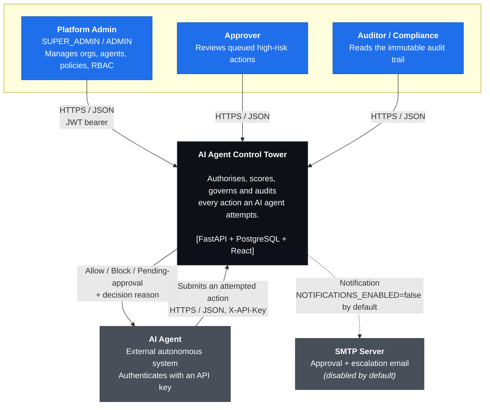

# C4 Level 1 — System Context

> **Scope:** the AI Agent Control Tower as a black box, and everything it talks to.

## What the system is

A **control plane for autonomous AI agents**. Agents do not act freely: every
attempted action is checked against permissions, scored for risk, evaluated
against organisation policy, and either allowed, blocked, or routed to a human
for approval. Every decision is written to an immutable audit trail.

The product is *governance*, not agent execution. The Control Tower never runs
an agent's task — it authorises or refuses it, and records what happened.

## Diagram

## Actors

| Actor | Trust | Authenticates with | Notes |
| ----- | ----- | ------------------ | ----- |
| Platform Admin | Semi-trusted | Password → JWT | `SUPER_ADMIN` bootstraps the org at registration |
| Approver | Semi-trusted | Password → JWT | Acts on the approval queue |
| Auditor | Read-only | Password → JWT | Audit trail is append-only |
| AI Agent | **Untrusted** | API key (`agt_live_…`), hashed at rest | Never granted a human session |

The agent is the adversary the system is designed around. It is assumed to be
capable, non-malicious-by-default, and *wrong sometimes* — an agent that has
been prompt-injected is indistinguishable from one that is merely mistaken.
Everything downstream of the API boundary treats agent input as hostile.

## External dependencies

Deliberately almost none. There is **no** message broker, cache, object store,
search cluster, or third-party identity provider in the current design.

| Dependency | Status | Rationale |
| ---------- | ------ | --------- |
| PostgreSQL 16 | Required | Sole datastore — see [ADR-0002](../adr/0002-postgresql-as-sole-datastore.md) |
| SMTP | Optional, default off | `NOTIFICATIONS_ENABLED=false`; notifications are logged instead |
| LLM provider | **None** | The governance decision path is deterministic — see [ADR-0006](../adr/0006-deterministic-governance-pipeline.md) |

That last row is the one enterprise buyers ask about first. The Control Tower
governs AI agents; it does not itself depend on an LLM to make a decision. A
decision is reproducible from the stored inputs.

## Boundaries this diagram implies

Crossing into the box requires authentication. Two distinct credential families
cross it, and they are not interchangeable:

- **Humans** present a password and receive a session-backed JWT.
- **Agents** present an API key and receive nothing — each request is
  independently authenticated.

See [C4 Level 2](./02-container.md) for how that boundary is enforced, and the
[threat model](../security/threat-model.md) for what happens when it isn't.
