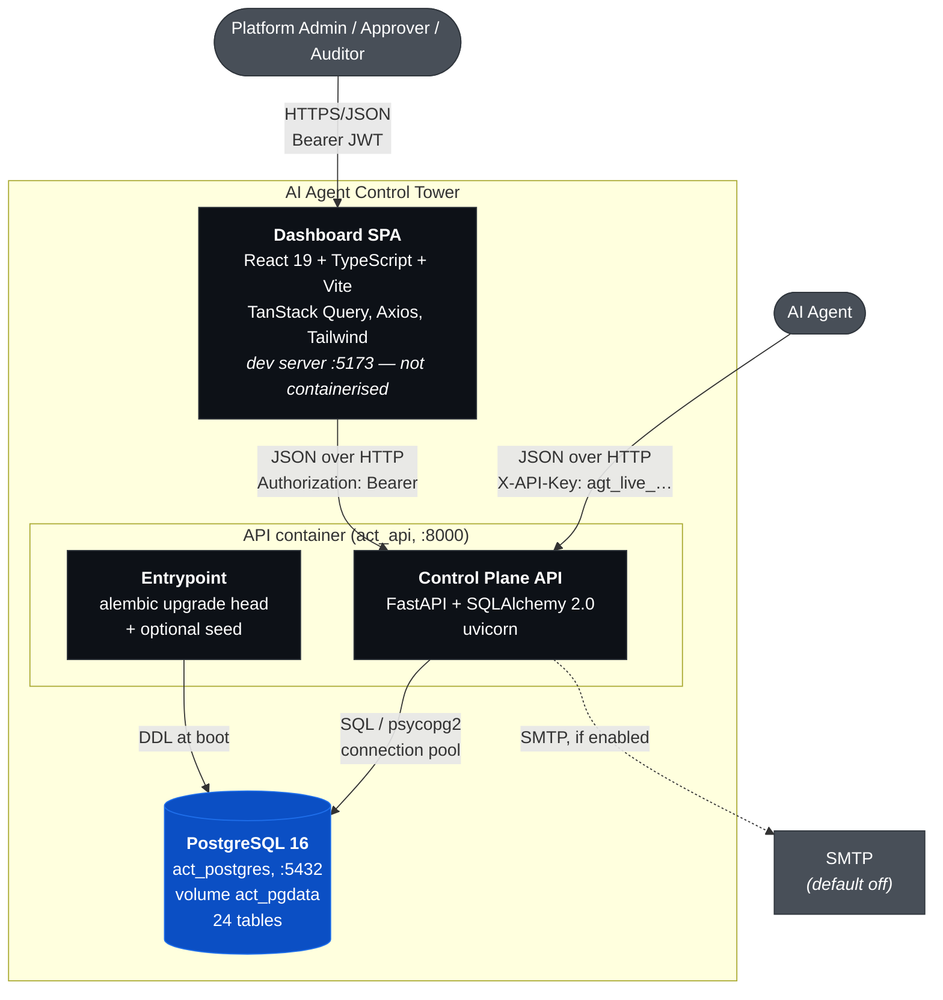
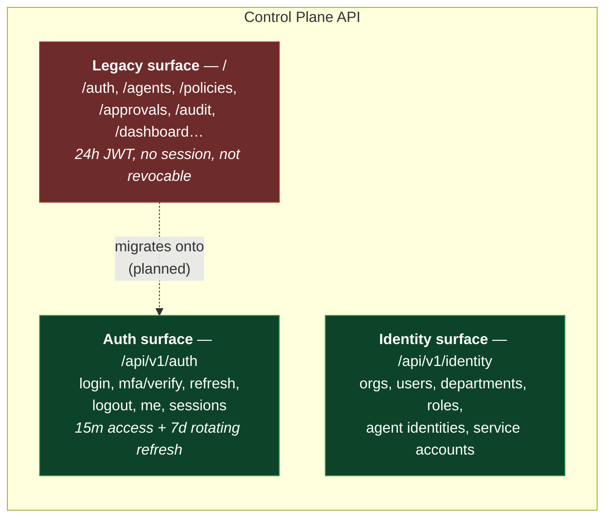
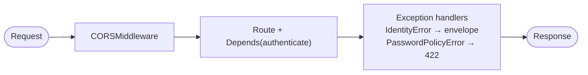

# C4 Level 2 — Containers

> **Scope:** the deployable/runnable units inside the Control Tower, and the
> protocols between them. Reflects `docker-compose.yml` and `backend/Dockerfile`
> as they exist on `main`.

## Diagram

## Containers

| Container | Technology | Ships in compose? | Responsibility |
| --------- | ---------- | ----------------- | -------------- |
| Dashboard SPA | React 19, TS (strict), Vite | **No** — dev server only | Renders the control plane; holds tokens in `localStorage` |
| Control Plane API | FastAPI, SQLAlchemy 2.0, uvicorn | Yes (`act_api`) | Authn/authz, governance pipeline, audit |
| PostgreSQL | `postgres:16-alpine` | Yes (`act_postgres`) | Sole system of record |

The SPA has **no Dockerfile**. It is a real gap for production, tracked in
[deployment](../deployment/deployment.md#gaps-before-production), not an
oversight this document should paper over.

## The three API surfaces

The API exposes three prefixes, which is a deliberate migration seam, not an
accident. `settings.API_PREFIX` is `""`, so the legacy surface sits at the root.

Two authentication systems coexist today. This is the single most important
thing to understand about the current architecture, and the reason for
[ADR-0005](../adr/0005-additive-identity-layer-alongside-legacy-auth.md):

| | Legacy `/auth/login` | `/api/v1/auth/login` |
| --- | --- | --- |
| Access token | JWT, **24h** (`ACCESS_TOKEN_EXPIRE_MINUTES=1440`) | JWT, **15 min** |
| Refresh token | None | Opaque `rt_…`, 7d, rotating, hashed at rest |
| Session record | None | `auth_sessions` row, revocable |
| Lockout | No | Yes — 5 failures / 15 min |
| Login history | No | Yes |
| Security events | No (audit log only) | Yes |

A token minted by the legacy route cannot be revoked and lives for a day. Since
Part 4.2.2.2 the `/api/v1/auth` surface revalidates its session on every request, so
revocation there is immediate — which makes the legacy route **the platform's only
non-revocable credential**, and its true worst-case session lifetime.

## Cross-cutting middleware

That is the entire middleware stack. There is **no** rate limiting, no security-
headers middleware, no request-ID middleware, and no HTTPS redirect. Forensic
context (`request_id`, `trace_id`) is read from client-supplied headers by
`RequestContext`, which means it is useful for correlation and **must not be
trusted for attribution**. See [threat model](../security/threat-model.md).

## Data flow summary

- The SPA never talks to PostgreSQL. All access is mediated by the API.
- Agents never receive a session or a refresh token.
- Migrations are applied by the API container's entrypoint (`alembic upgrade
  head`) before uvicorn starts — so a rolling deploy of >1 API replica would
  race. Single-replica assumption, documented in
  [deployment](../deployment/deployment.md).
