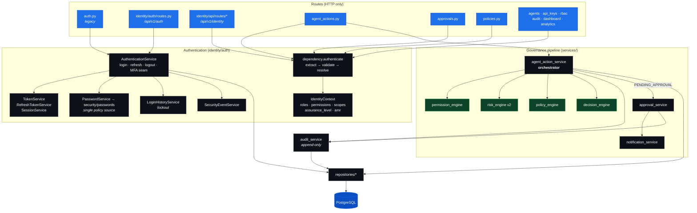

# C4 Level 3 — Components inside the Control Plane API

> **Scope:** the internals of `backend/app`. Every box maps to a real module.

## Layering rule

```
routes  →  services / engines  →  repositories  →  models  →  PostgreSQL
```

Routes handle HTTP only. Services own transactions and orchestration. Engines are
pure(ish) decision functions. Nothing below `routes` imports FastAPI.

The one place this rule is enforced by the type system is the identity layer:
`Depends(authenticate)` resolves an `IdentityContext`, and **services depend on
the context, never on the raw token**.

## Diagram



## Components

### Authentication (`app/identity/auth/`)

| Component | File | Responsibility |
| --------- | ---- | -------------- |
| `authenticate` | `dependency.py` | The single authn entry point. Extracts JWT or API key, validates, resolves `IdentityContext` |
| `IdentityContext` | `context.py` | The only thing services see. Carries roles, permissions, `assurance_level`, `amr`, `session_id` |
| `AuthenticationService` | `authentication_service.py` | Orchestrates login / refresh / logout / MFA step-up |
| `TokenService` | `token_service.py` | Mint + validate access JWTs |
| `RefreshTokenService` | `refresh_token_service.py` | Issue / rotate / detect reuse / revoke family |
| `SessionService` | `session_service.py` | Session lifecycle |
| `PasswordService` | `password_service.py` | Facade over `identity/security/passwords.py` — the one policy definition |
| `LoginHistoryService` | `login_history_service.py` | Records every attempt; drives lockout |
| `SecurityEventService` | `security_event_service.py` | Emits `security_events` rows |

`require_scope(...)` and `require_assurance(...)` are dependency factories that
gate a route on a permission or on multi-factor assurance. An MFA-pending
challenge token is rejected by both — it can only be exchanged at `/auth/mfa/verify`.

> **Note on API-key auth:** `dependency.authenticate` recognises machine key
> prefixes (`agt_live_`, `svc_live_`, `sk_`) but currently raises
> `API_KEY_INVALID` — machine credentials are resolved on the *legacy* surface by
> `api_key_service`. Machine auth on `/api/v1` lands in Part 4.2.2. The dispatch
> is deliberately in place so machine auth cannot silently succeed.

### Governance pipeline (`app/services/`)

`process_agent_action` is the heart of the product. It is a single, linear,
seven-step function — see [the sequence diagram](../sequences/03-agent-action-governance.md).

| Engine | Input | Output | Pure? |
| ------ | ----- | ------ | ----- |
| `permission_engine` | agent, resource, action | allowed / denied | Reads DB |
| `risk_engine` | resource, action, payload | score + transparent breakdown | Yes |
| `policy_engine` | org, resource, action, payload | matched policy + decision | Reads DB |
| `decision_engine` | agent status, permission, risk, policy | `ALLOW` / `BLOCK` / `PENDING_APPROVAL` | Yes |

Precedence is *first decisive rule wins*: inactive agent → permission denied →
matched policy (which overrides risk) → global risk thresholds (`≤40` allow,
`41–80` approval, `>80` block).

> **Known gap:** `agents.max_allowed_risk`, `human_approval_required`,
> `auto_suspend_threshold` and `default_risk_score` are persisted but read by no
> engine. Per-agent risk posture is not yet wired into `decision_engine` — see
> [the governance sequence](../sequences/03-agent-action-governance.md#configured-but-unused-agent-columns).

The decision is a **pure function of stored inputs**. Given an `agent_actions`
row and the policies in force at that moment, the decision is reproducible —
which is precisely what an auditor asks for. No LLM is consulted
([ADR-0006](../adr/0006-deterministic-governance-pipeline.md)).

### Audit (`app/services/audit_service.py`)

`log_event` is the only writer. There is no update or delete path for
`audit_logs` anywhere in the codebase. Note that append-only is enforced **by
convention, not by the database** — no trigger, no revoked `UPDATE`/`DELETE`
grant. That is an accepted risk, recorded in the
[threat model](../security/threat-model.md#t-tampering).

Every audit row carries `before_state` / `after_state` JSONB plus `ip_address`,
`user_agent`, `request_id`, `trace_id`.

## Where the two auth systems meet

`AuthenticationService.login` calls `app.services.auth_service.authenticate_user`
— the legacy credential check — and then builds a modern session on top of it.
This is the seam that lets the legacy surface be retired route-by-route rather
than in one cutover.
