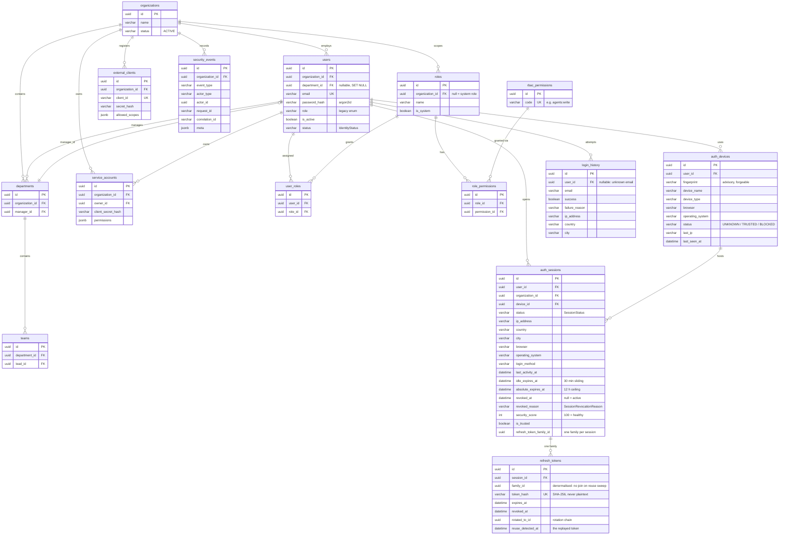
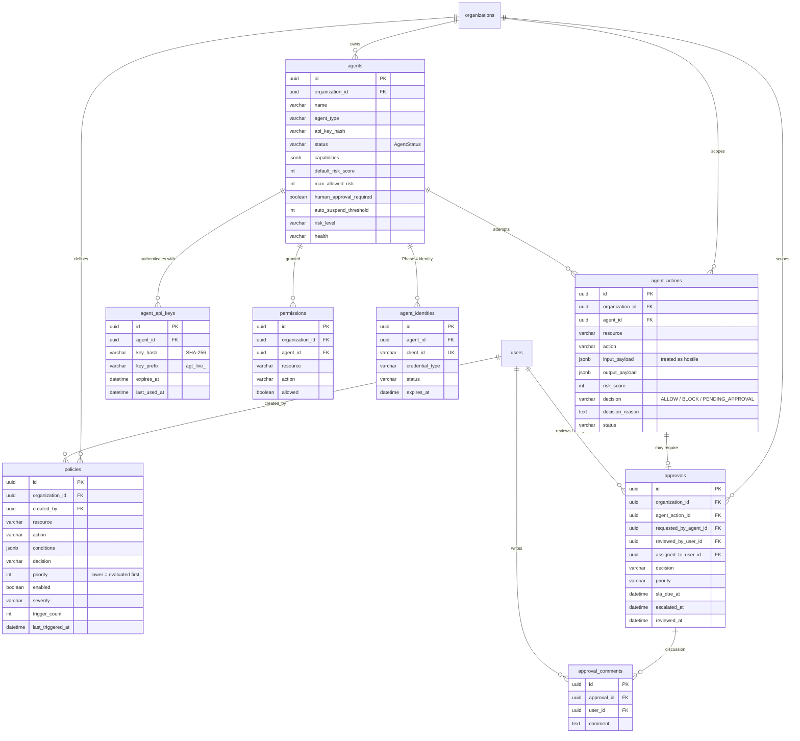
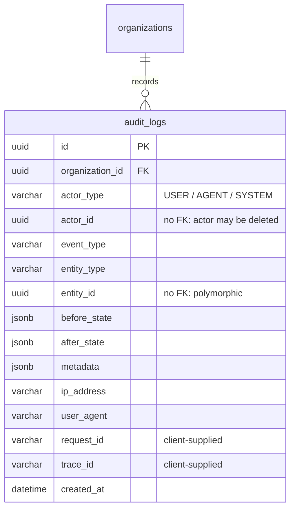

# Entity Relationship Diagrams

> **24 tables**, generated from `Base.metadata` and verified against
> `backend/migrations/versions/0001…0009`. Split by bounded context because a
> single 24-table diagram is a poster, not a document.

Verify the table count still matches:

```bash
cd backend && python -c "import app.main; from app.core.database import Base; print(len(Base.metadata.tables))"
```

## Global invariants

- **Every primary key is a UUID.** No sequential integer IDs are exposed.
- **`organizations` is the tenancy root.** Nearly every table carries
  `organization_id` with `ON DELETE CASCADE`. Multi-tenancy is enforced in the
  service layer by filtering on the caller's org — **not** by Postgres row-level
  security. See [threat model](../security/threat-model.md#t-tampering).
- **Secrets are never stored in plaintext.** `password_hash` (argon2id),
  `token_hash` / `key_hash` / `secret_hash` (SHA-256 of a high-entropy token).
- Timestamps are `TimestampMixin` (`created_at`, `updated_at`) except on
  append-only tables, which carry `created_at` only.

---

## 1. Identity & Access

The Phase 4 identity platform. `users` predates it; everything else here was
added by migrations `0006`–`0009`.



### Notes that matter

- **`refresh_tokens.rotated_to_id` + `revoked_at` encode reuse detection.** A
  token that is *revoked and already rotated* has been replayed → theft signal →
  the family is revoked and the session becomes `SUSPICIOUS`. Requiring *both*
  conditions is what stops an ordinary logout from being reported as theft.
- **`family_id` is first-class and denormalised** onto `refresh_tokens`, so a reuse
  sweep never needs a join and a family survives its session row forensically.
- **`auth_sessions` carries two deadlines.** `idle_expires_at` slides forward on
  activity; `absolute_expires_at` never moves. Both are enforced on every request
  — see [session lifecycle](../../identity/session-lifecycle.md).
- **`auth_devices.fingerprint` is advisory.** It is derived from client-supplied
  headers, so it can be forged; it recognises a device for UX and risk scoring and
  is never an authentication factor. `BLOCKED` can only deny, never grant.
- **`login_history.user_id` is nullable on purpose.** A failed login for an
  unknown email must still be recorded without leaking that the email is unknown.
- `users.role` (legacy enum) and `user_roles` (RBAC) both exist. The enum is the
  legacy coarse role; RBAC is the real authorization source. Another artefact of
  the [additive migration](../adr/0005-additive-identity-layer-alongside-legacy-auth.md).

---

## 2. Agent Governance

The product's core domain: what an agent tried to do, and what we decided.



### Notes that matter

- **`agent_actions.input_payload` is attacker-controlled JSONB.** It is stored
  verbatim for forensics and rendered in the dashboard. Any consumer must treat
  it as untrusted — see [threat model](../security/threat-model.md#s-spoofing).
- **`agents.max_allowed_risk`, `human_approval_required`, `auto_suspend_threshold`
  and `default_risk_score` are written but never read.** No engine consumes them;
  `decision_engine` uses global constants. Setting them has no effect today — see
  [the governance sequence](../sequences/03-agent-action-governance.md#configured-but-unused-agent-columns).
- `policies.priority` orders evaluation (lower first); `conditions` is a JSONB
  predicate tree interpreted by `policy_engine`.
- `approvals` carries SLA + escalation fields; `agent_actions` ↔ `approvals` is
  0..1 — only `PENDING_APPROVAL` decisions create a row.
- `agents.api_key_hash` (Phase 1) and `agent_api_keys` (Phase 2, rotatable)
  coexist. New code should use `agent_api_keys`.

---

## 3. Audit

One table. Deliberately isolated: it references `organizations` and nothing else,
so it can be moved to cold storage or a separate database without a schema change.



`actor_id` and `entity_id` intentionally carry **no foreign key**: an audit
record must survive the deletion of the thing it describes. This is the standard
trade-off for audit tables and is why cascading deletes cannot erase history.

`request_id` and `trace_id` come from request headers. They are correlation aids,
**not** evidence of identity.
