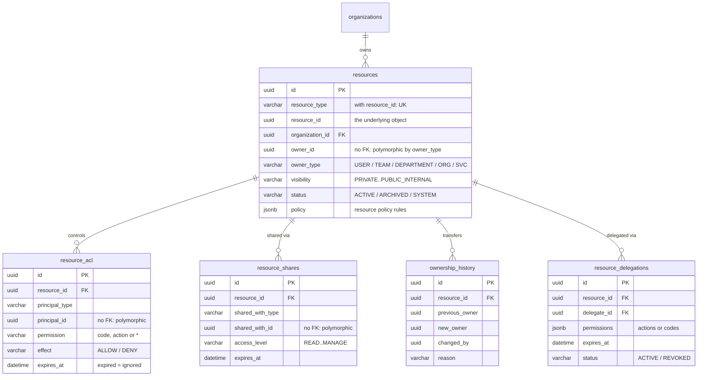
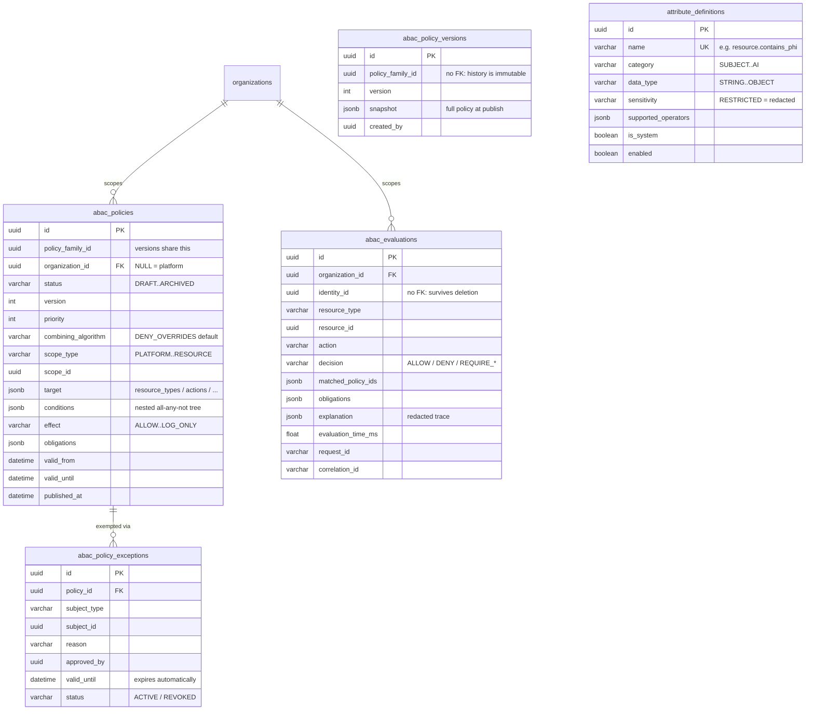
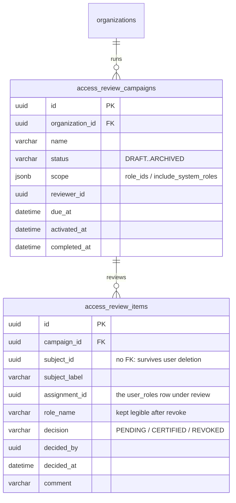
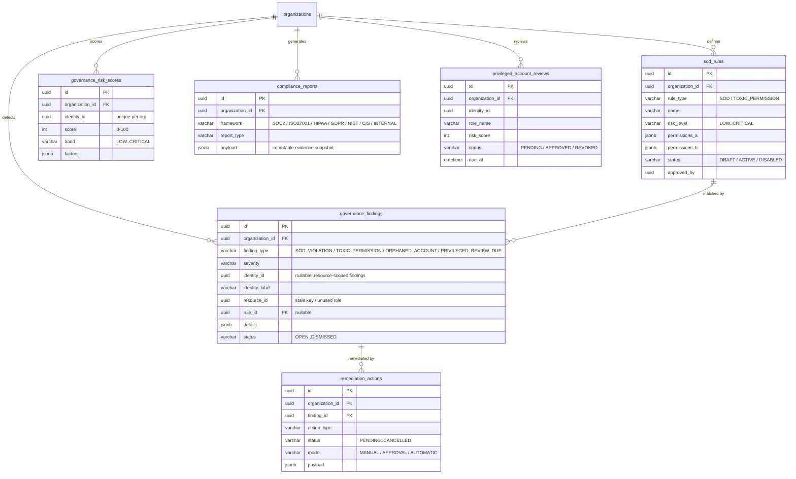
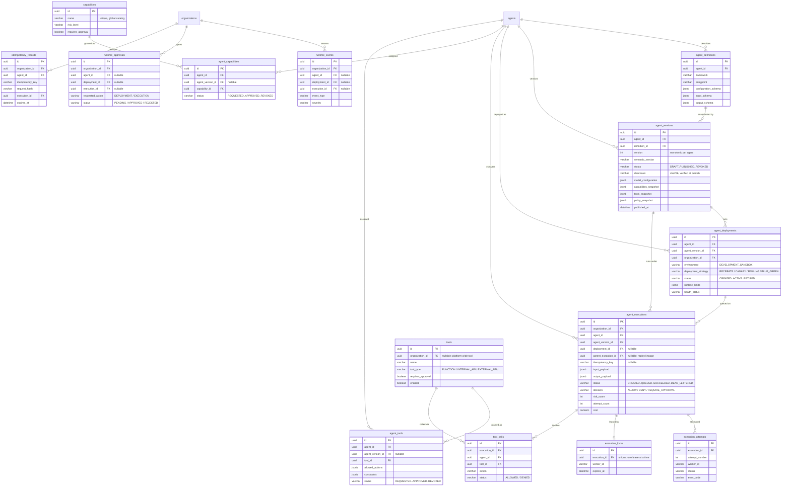
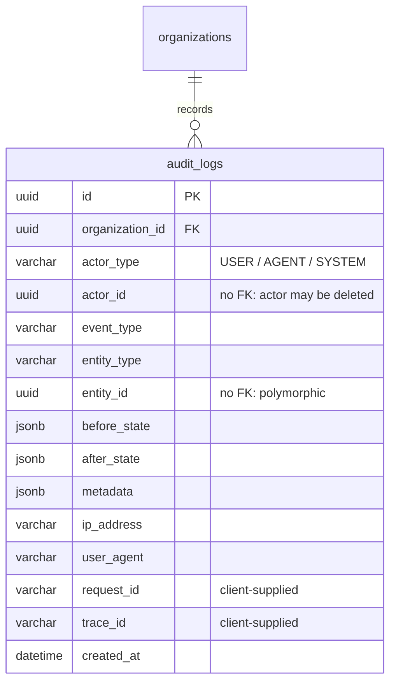

# Entity Relationship Diagrams

> **24 tables**, generated from `Base.metadata` and verified against
> `backend/migrations/versions/0001…0009`. Split by bounded context because a
> single 24-table diagram is a poster, not a document.

Verify the table count still matches:

```bash
cd backend && python -c "import app.main; from app.core.database import Base; print(len(Base.metadata.tables))"
```

## Global invariants

- **Every primary key is a UUID.** No sequential integer IDs are exposed.
- **`organizations` is the tenancy root.** Nearly every table carries
  `organization_id` with `ON DELETE CASCADE`. Multi-tenancy is enforced in the
  service layer by filtering on the caller's org — **not** by Postgres row-level
  security. See [threat model](../security/threat-model.md#t-tampering).
- **Secrets are never stored in plaintext.** `password_hash` (argon2id),
  `token_hash` / `key_hash` / `secret_hash` (SHA-256 of a high-entropy token).
- Timestamps are `TimestampMixin` (`created_at`, `updated_at`) except on
  append-only tables, which carry `created_at` only.

---

## 1. Identity & Access

The Phase 4 identity platform. `users` predates it; everything else here was
added by migrations `0006`–`0009`.


### Notes that matter

- **`refresh_tokens.rotated_to_id` + `revoked_at` encode reuse detection.** A
  token that is *revoked and already rotated* has been replayed → theft signal →
  the family is revoked and the session becomes `SUSPICIOUS`. Requiring *both*
  conditions is what stops an ordinary logout from being reported as theft.
- **`family_id` is first-class and denormalised** onto `refresh_tokens`, so a reuse
  sweep never needs a join and a family survives its session row forensically.
- **`auth_sessions` carries two deadlines.** `idle_expires_at` slides forward on
  activity; `absolute_expires_at` never moves. Both are enforced on every request
  — see [session lifecycle](../../identity/session-lifecycle.md).
- **`auth_devices.fingerprint` is advisory.** It is derived from client-supplied
  headers, so it can be forged; it recognises a device for UX and risk scoring and
  is never an authentication factor. `BLOCKED` can only deny, never grant.
- **`login_history.user_id` is nullable on purpose.** A failed login for an
  unknown email must still be recorded without leaking that the email is unknown.
- `users.role` (legacy enum) and `user_roles` (RBAC) both exist. The enum is the
  legacy coarse role; RBAC is the real authorization source. Another artefact of
  the [additive migration](../adr/0005-additive-identity-layer-alongside-legacy-auth.md).

### Resource-based authorization (Phase 4.3.4)

Fine-grained, per-resource authorization metadata. `resources` is the registry;
the four satellite tables cascade with it. `(resource_type, resource_id)` also
links to the Phase 4.3.3 `resource_ownership` hierarchy path (not shown).



`owner_id`, `principal_id` and `shared_with_id` are polymorphic (typed by their
companion `*_type` column), so they carry no FK — the same pattern as
`audit_logs.actor_id`. Explicit DENY beats every allow; expired rows are ignored
at evaluation time — see [resource authorization](../../authorization/resource-authorization.md).

### ABAC engine (Phase 4.3.5)

Context-aware policies layered over RBAC + resource authorization. A row in
`abac_policies` is one *version*; versions of the same logical policy share
`policy_family_id` and at most one version per family is `ACTIVE`.
`organization_id IS NULL` marks a platform-level policy that applies to every
tenant and cannot be overridden by organization policies.



`abac_policy_versions` deliberately carries **no FK** to `abac_policies`:
published history must survive even if the working row is deleted (§40.13).
Only names registered in `attribute_definitions` may appear in `conditions`;
`RESTRICTED` attributes are redacted from user-facing explanations and logs —
see [ABAC overview](../../authorization/abac/overview.md).

### Access reviews (Phase 4.3.7)

Periodic access certification. Activating a campaign snapshots every in-scope
role assignment as an item; a REVOKED decision removes the underlying
`user_roles` row through the RBAC service.



`subject_id`, `assignment_id` and the label columns are deliberately
denormalized: a completed campaign is a compliance record and must stay
readable after the user, role or assignment it certified is gone — see
[access reviews](../../admin/access-reviews.md).

### Identity Governance & Administration (Phase 4.3.8)

SoD and toxic-permission detection share one rule table (`rule_type`
discriminates them). A rule match creates a `governance_findings` row;
findings drive `remediation_actions`. Risk scores, compliance reports and
privileged-account reviews are independent snapshot tables, each keyed to an
identity or organization rather than to one another.



Findings are the hub: SoD/toxic detection, orphaned-identity scans and
privileged-review-due checks all write to the same `governance_findings`
table, so the findings explorer and the remediation queue see every
governance issue regardless of source — see
[docs/governance/](../../governance/).

---

### Agent Runtime & Lifecycle Management (Phase 5.0)

`agents` (§1 above) gains additive runtime-lifecycle columns rather than a
parallel registry: `slug`, `project_id`, `owner_type`/`owner_id`,
`criticality`, `data_classification`, `default_environment`,
`lifecycle_status`, `archived_at`. Everything below hangs off
`agents.id`. `agent_executions` doubles as the execution queue — a worker
claims a row with `SELECT ... FOR UPDATE SKIP LOCKED` and takes a lease in
`execution_locks`; there is no separate queue table. See
[docs/runtime/architecture.md](../../runtime/architecture.md).



`deployment_health` (one row per heartbeat sample, FK to
`agent_deployments`) is omitted above for readability — see
[docs/runtime/health-and-observability.md](../../runtime/health-and-observability.md).

---

## 2. Agent Governance

The product's core domain: what an agent tried to do, and what we decided.


### Notes that matter

- **`agent_actions.input_payload` is attacker-controlled JSONB.** It is stored
  verbatim for forensics and rendered in the dashboard. Any consumer must treat
  it as untrusted — see [threat model](../security/threat-model.md#s-spoofing).
- **`agents.max_allowed_risk`, `human_approval_required`, `auto_suspend_threshold`
  and `default_risk_score` are written but never read.** No engine consumes them;
  `decision_engine` uses global constants. Setting them has no effect today — see
  [the governance sequence](../sequences/03-agent-action-governance.md#configured-but-unused-agent-columns).
- `policies.priority` orders evaluation (lower first); `conditions` is a JSONB
  predicate tree interpreted by `policy_engine`.
- `approvals` carries SLA + escalation fields; `agent_actions` ↔ `approvals` is
  0..1 — only `PENDING_APPROVAL` decisions create a row.
- `agents.api_key_hash` (Phase 1) and `agent_api_keys` (Phase 2, rotatable)
  coexist. New code should use `agent_api_keys`.

---

## 3. Audit

One table. Deliberately isolated: it references `organizations` and nothing else,
so it can be moved to cold storage or a separate database without a schema change.



`actor_id` and `entity_id` intentionally carry **no foreign key**: an audit
record must survive the deletion of the thing it describes. This is the standard
trade-off for audit tables and is why cascading deletes cannot erase history.

`request_id` and `trace_id` come from request headers. They are correlation aids,
**not** evidence of identity.
