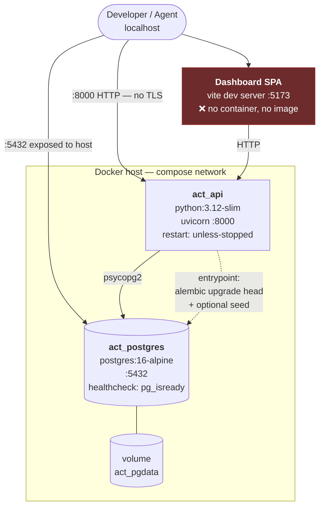
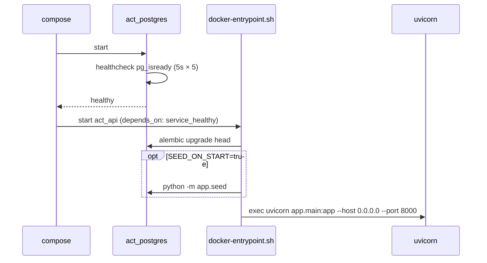
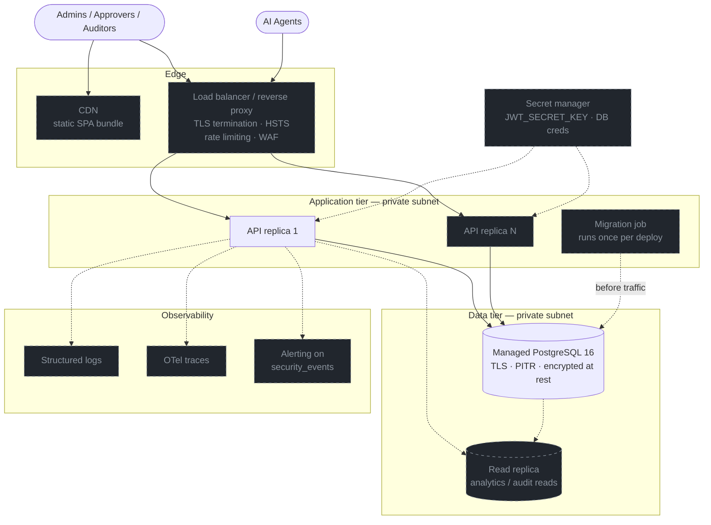

# Deployment

> **Honest summary:** what exists today is a *local development stack*. It is not
> a production topology and must not be represented as one. This document
> describes what ships, then what production requires.

## What exists today

From `docker-compose.yml` and `backend/Dockerfile`:



### Boot sequence



**Migrations run inside the API container's entrypoint, before uvicorn starts.**
That is convenient for a single container and *incorrect for more than one*: N
replicas would run `alembic upgrade head` concurrently on boot. The current
architecture assumes **exactly one API replica**. Horizontal scaling requires
extracting migrations into a separate job — this is the single biggest structural
blocker to scaling out, and it is cheap to fix before it matters.

## Configuration surface

| Variable | Compose value | Production requirement |
| -------- | ------------- | ---------------------- |
| `DATABASE_URL` | `postgres:postgres@db:5432` | Managed Postgres, rotated credentials, TLS |
| `JWT_SECRET_KEY` | `change-me-in-docker-compose` | ≥256-bit random, from a secret manager |
| `ACCESS_TOKEN_EXPIRE_MINUTES` | `1440` (legacy surface) | Retire with the legacy surface |
| `SEED_ON_START` | `true` | **`false`** — seeds a known demo user |
| `NOTIFICATIONS_ENABLED` | `false` | `true` + real SMTP credentials |
| `BACKEND_CORS_ORIGINS` | localhost:3000, :5173 | Exact production origins only |

`backend/app/core/config.py` defaults `JWT_SECRET_KEY` to
`"change-me-in-production"`. **The application starts happily with it.** Nothing
fails closed. See [threat model](../security/threat-model.md#s-spoofing).

## Gaps before production

Stated plainly, because an auditor will find them anyway:

| # | Gap | Impact | Fix |
| - | --- | ------ | --- |
| 1 | **No TLS anywhere** | Bearer tokens and API keys traverse plaintext HTTP | Terminate TLS at a reverse proxy / LB; add HSTS |
| 2 | **No reverse proxy** | No rate limiting, no request size cap, no security headers | nginx / Traefik / cloud LB in front of uvicorn |
| 3 | **No rate limiting** | Credential stuffing bounded only by per-account lockout; agent API keys unbounded | Proxy-level + per-key limits |
| 4 | **Frontend not containerised** | No reproducible build artefact | Multi-stage Dockerfile → static assets on CDN |
| 5 | **Secrets in compose file** | DB password and JWT secret in version control | Secret manager; fail closed on default secret |
| 6 | **`SEED_ON_START=true`** | Demo org + known credentials created on boot | Default `false` |
| 7 | **Postgres `:5432` published to host** | DB reachable from the host network | Remove `ports:` — the compose network suffices |
| 8 | **Migrations in API entrypoint** | Blocks >1 replica | Separate migration job |
| 9 | **No API healthcheck / readiness** | Orchestrators cannot gate traffic | `/health` exists — wire it into compose + LB |
| 10 | **No backups, no PITR** | `act_pgdata` is the only copy of the audit trail | Managed Postgres w/ PITR; test restores |
| 11 | **No structured logging / metrics / tracing** | `trace_id` is captured but goes nowhere | Ship logs; export OTel spans |

Items 1–3 and 5–7 are the ones that make the current stack unsafe to expose to a
network. None is hard; none is done.

## Target production topology (planned)

> Dashed = not implemented. This is a target, not a description.



### What makes this topology reachable

The application is **stateless** — no in-process session store, no local cache,
no filesystem writes. Every piece of state is in PostgreSQL. Once migrations move
out of the entrypoint (gap 8), horizontal scaling is a load-balancer config, not
a rewrite.

The one caveat is the [access-token revocation gap](../sequences/02-token-refresh-and-reuse.md#known-gap-access-tokens-survive-revocation):
statelessness is exactly *why* a revoked session's access token still works. If
that gap is ever closed with a denylist, the denylist becomes shared state and
the "no external dependencies" property in
[ADR-0002](../adr/0002-postgresql-as-sole-datastore.md) will need revisiting —
a Postgres table would work at current scale.

## Local development

```bash
docker compose up -d db          # database only
cd backend && alembic upgrade head && uvicorn app.main:app --reload --port 8001
cd frontend && npm run dev       # :5173
```

The backend runs on `:8001` locally to avoid colliding with the compose `act_api`
on `:8000`.
