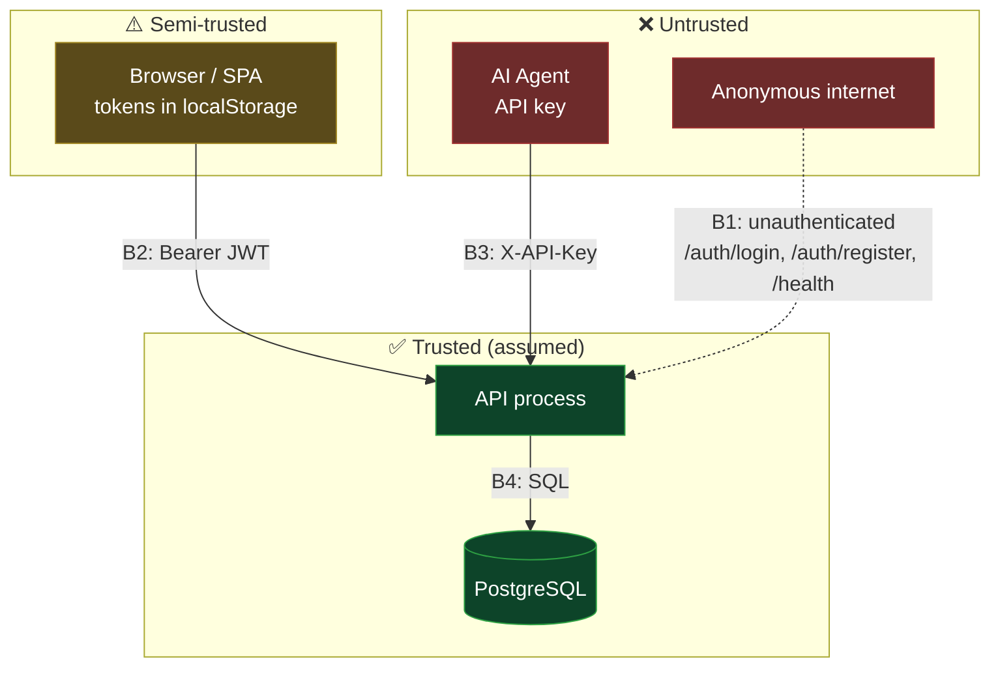
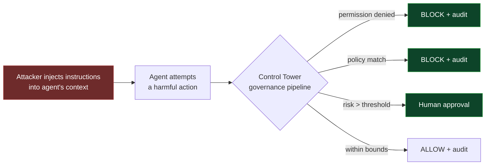

# Threat Model

> **Method:** STRIDE, applied per trust boundary.
> **Scope:** the whole platform. The identity subsystem has a narrower,
> deeper model in [`docs/identity/trust-model.md`](../../identity/trust-model.md);
> this document does not restate it.
>
> **Status of every row is real.** Mitigations marked ✅ are implemented and
> tested. ⚠️ means partially mitigated. ❌ means accepted or unmitigated risk.
> A threat model with no ❌ rows is a sales document.

## Assets, ranked

| # | Asset | Why it matters |
| - | ----- | -------------- |
| 1 | **The audit trail** (`audit_logs`, `security_events`) | The product's reason to exist. If it can be forged or erased, nothing else matters. |
| 2 | **Governance decisions** (`agent_actions`, `policies`) | Determines what agents may do |
| 3 | **Credentials** (`password_hash`, `token_hash`, `key_hash`) | Compromise → full impersonation |
| 4 | **Tenant isolation** (`organization_id`) | Cross-tenant read = breach |
| 5 | Agent input payloads | Attacker-controlled, stored, and rendered |

## Trust boundaries

| Boundary | Crossing | Enforced by |
| -------- | -------- | ----------- |
| B1 | Anonymous → API | Nothing. These routes are public by design. |
| B2 | Browser → API | `Depends(authenticate)` → JWT signature + expiry |
| B3 | Agent → API | API-key hash lookup (legacy surface) |
| B4 | API → DB | Service-layer `organization_id` filtering |

**B4 is the weakest link and the least obvious.** Tenant isolation is application
logic, not a database guarantee. A single missing `.where(organization_id == …)`
is a cross-tenant data breach with no second line of defence.

---

## S — Spoofing

| Threat | Mitigation | Status |
| ------ | ---------- | ------ |
| Password guessing | Account lockout: 5 failures / 15 min window, checked *before* credential verification | ✅ tested |
| Credential stuffing across many accounts | Per-account lockout only; **no rate limit per IP** | ❌ gap 3 |
| Weak passwords | ≥12 chars, 4 classes, blocklist, no email/username substring — enforced at every password-setting route | ✅ tested |
| Password cracking after DB theft | argon2id; legacy bcrypt transparently upgraded on next login | ✅ |
| Forged JWT | HS256 signature check | ⚠️ **`JWT_SECRET_KEY` defaults to `"change-me-in-production"` and the app boots with it.** Anyone who reads this public repo can mint tokens against a default-configured deployment. |
| Stolen refresh token | Rotation on every use + reuse detection → token family revoked, session marked `SUSPICIOUS` | ✅ tested |
| Stolen access token (session-bearing) | Session revalidated on **every** request, on both the `/api/v1/auth` and legacy dependencies; revocation is immediate platform-wide | ✅ tested ([ADR-0007](../adr/0007-stateful-session-validation.md)) |
| Refresh token or MFA-challenge token replayed as a bearer token | Rejected by `decode_access_token` (`token_type` / `mfa_pending`) | ✅ tested |
| Token minted for another audience/issuer | `aud`/`iss` validated when present | ✅ tested |
| Stolen access token (legacy `/auth/login`) | Nothing — no `session_id` claim, so no session to check | ❌ **24 h**, now the only non-revocable credential |
| Stolen access token used after idle/absolute timeout | Timeouts enforced per request (30 min / 12 h) | ✅ tested |
| Attacker signs in from a blocked device | Login refused with `DEVICE_BLOCKED` (403); blocking also revokes live sessions | ✅ tested |
| Agent API-key theft | Hashed at rest; rotatable via `agent_api_keys`; no per-key rate limit | ⚠️ |
| Forged `request_id` / `trace_id` | None — read straight from client headers | ❌ correlation only, never attribution |

> **Highest-priority finding.** The default JWT secret should fail closed. A
> startup assertion that refuses to boot outside `DEBUG` when
> `JWT_SECRET_KEY` is a known default is a few lines and removes an entire class
> of catastrophic misconfiguration.

## T — Tampering

| Threat | Mitigation | Status |
| ------ | ---------- | ------ |
| Editing/deleting audit history | No `UPDATE`/`DELETE` path exists in code | ⚠️ **convention only** — no DB trigger, no revoked grant. A SQL-injection or a compromised app credential can rewrite history. |
| Cross-tenant write | Service-layer `organization_id` filter | ⚠️ no Postgres RLS; one missing filter = breach |
| SQL injection | SQLAlchemy parameterised queries throughout | ✅ |
| Policy tampering | `policies` writes require RBAC permission; audited | ✅ |
| Agent escalating its own permissions | Agents cannot reach identity or RBAC routes; `authenticate` never issues an agent a human context | ✅ |
| Migration tampering at boot | Entrypoint runs `alembic upgrade head` with full DDL rights | ❌ accepted for single-node dev |

> The audit trail is asset #1 and is protected by *convention*. Two cheap
> hardening steps: a `BEFORE UPDATE OR DELETE` trigger that raises on
> `audit_logs`, and running the app as a role without `UPDATE`/`DELETE` on it.
> Consider append-only enforcement before the first compliance audit, not after.

## R — Repudiation

| Threat | Mitigation | Status |
| ------ | ---------- | ------ |
| "The agent never did that" | Every decision — allow *and* block — writes an `audit_logs` row with `before_state`/`after_state`, risk breakdown, and matched policy | ✅ |
| "Who ended my session?" | `security_events` is readable: per-org stream, per-identity timeline, per-session history — with the acting administrator on every force-logout | ✅ tested |
| Security events recorded but unreadable | Read path + indexes (`0011`); an audit event nobody can read is not an audit trail | ✅ tested |
| "That decision was arbitrary" | Decision is a pure function of stored inputs → replayable | ✅ [ADR-0006](../adr/0006-deterministic-governance-pipeline.md) |
| "I never logged in" | `login_history` records every attempt incl. failures, IP, UA | ✅ |
| "Someone else used my session" | `auth_sessions` records device, IP, browser, security score; user *and admin* can list and revoke sessions. Audit `actor_id` has **no FK** and IP/UA/device fingerprint are spoofable | ⚠️ |
| Session timeout leaves no audit trail | `SESSION_TIMEOUT` + `SESSION_EXPIRED` recorded on every idle/absolute expiry | ✅ tested |
| Admin force-logout with no accountability | Every admin revocation records `actor_id` + `actor_email` alongside the subject | ✅ tested |
| Clock manipulation | All timestamps server-side, `datetime.now(timezone.utc)` | ✅ |

## I — Information Disclosure

| Threat | Mitigation | Status |
| ------ | ---------- | ------ |
| User enumeration via login response | Unknown-email and wrong-password return byte-identical `401 INVALID_CREDENTIALS` | ✅ |
| User enumeration via **timing** | Unknown email skips argon2id verify → measurably faster | ❌ accepted; fix = dummy verify on miss |
| Enumeration via session revoke | Revoking another user's session returns a generic `404`, never "not yours" | ✅ |
| Token theft via XSS | Access **and refresh** tokens in `localStorage`, readable by any script on the origin | ❌ accepted; `httpOnly` cookie + CSRF is the alternative |
| Secrets in logs | Passwords/tokens never logged; `password_service` never logs plaintext | ✅ |
| Secrets in VCS | DB password + JWT secret literal in `docker-compose.yml` | ❌ gap 5 |
| Credentials on the wire | **No TLS** in the shipped stack | ❌ gap 1 |
| Stack traces to clients | `IdentityError` → structured envelope; `PasswordPolicyError` → 422 | ✅ |
| Cross-tenant read | Service-layer filter | ⚠️ see B4 |
| Low-privilege user reading the org security stream | Gated on `session.view` (admins only), **not** `audit.view` — which every built-in role including `VIEWER` holds | ✅ tested |
| A user reading another user's security events | `/api/v1/auth/security-events` is scoped to `actor_id = me` and accepts no `actor_id` parameter | ✅ tested |

> The `localStorage` decision is worth stating precisely for buyers: an XSS on the
> dashboard origin yields a 7-day refresh token, not just a 15-minute access
> token. Reuse detection limits the blast radius (the thief is evicted the moment
> the real client refreshes) but does not prevent the initial theft.

## D — Denial of Service

| Threat | Mitigation | Status |
| ------ | ---------- | ------ |
| Login flood | Lockout gate runs **before** argon2id, so locked accounts cost ~one indexed count query | ✅ deliberate ordering |
| argon2id CPU exhaustion via unknown emails | None — every unknown email skips the hash, every *known* email pays it until lockout | ⚠️ |
| Unbounded request bodies | None — no proxy, no size cap. `input_payload` is unbounded JSONB. | ❌ gap 2 |
| Agent action flood | No per-key rate limit | ❌ gap 3 |
| `login_history` / `audit_logs` growth | No retention policy or partitioning | ❌ |
| DB connection exhaustion | SQLAlchemy pool defaults | ⚠️ |
| **Session-lookup amplification** | Every authenticated request now costs one indexed PK read; a valid-looking JWT forces it. No rate limiting exists. | ❌ **new in 4.2.2.2** — see [ADR-0007](../adr/0007-stateful-session-validation.md) |
| Session-row write contention | `last_activity_at` writes throttled to 1/60 s per session | ✅ |
| Session table growth | No retention policy; sessions are never hard-deleted (they are the audit record) | ❌ |
| Lockout as a weapon (attacker locks a victim out) | Inherent to any lockout scheme | ❌ accepted; window is 15 min |

## E — Elevation of Privilege

| Threat | Mitigation | Status |
| ------ | ---------- | ------ |
| Agent → human privileges | `authenticate` never mints a human context from an API key; `/api/v1` machine auth deliberately fails closed with `API_KEY_INVALID` | ✅ |
| MFA challenge token used as a session | `mfa_pending` claim rejected by both `require_scope` and `require_assurance` | ✅ tested |
| Bypassing step-up on sensitive routes | `require_assurance(AAL2)` rejects single-factor tokens | ✅ (no factor enrolled yet) |
| Horizontal escalation (other tenant) | `organization_id` filter | ⚠️ B4 |
| Admin revoking a session in another organization | Target resolved through the actor's org via the session's *owner*, not its denormalised `organization_id`; 404 either way | ✅ tested |
| Non-admin force-logging-out a colleague | `session.revoke` permission, granted only to SUPER_ADMIN/ADMIN | ✅ tested |
| Vertical escalation via RBAC | `require_scope` checks scope *and* permission | ✅ |
| Legacy 24 h token outliving a demotion | Legacy JWT carries no session and is not revocable | ❌ P2: retire the legacy surface |
| Session outliving an account suspension | Suspending/disabling an identity revokes every live session (`ACCOUNT_DISABLED`) | ✅ tested |
| Privileged bootstrap | `/auth/register` creates a `SUPER_ADMIN` **and is unauthenticated** | ⚠️ by design (self-serve signup); each registration creates its own isolated org |

---

## Prompt injection: the agent-specific threat

The Control Tower's premise is that **a prompt-injected agent is indistinguishable
from a buggy one**, so it does not try to tell them apart.

The mitigation is architectural, not detective: the agent's *intent* is never
consulted, only its requested `(resource, action, payload)` against
deterministic permissions, policy, and risk. An agent that has been fully
compromised still cannot exceed the permissions granted to it, and every attempt
it makes is recorded.

**The residual risk is the blast radius of a legitimately-granted permission.**
If an agent is granted `database:delete`, injection makes that grant dangerous. The
only bounds today are the org's `policies` and two *global* risk thresholds.

The per-agent bounds that should narrow this — `agents.max_allowed_risk`,
`human_approval_required`, `auto_suspend_threshold` — are **persisted but consumed
by no engine**. Setting them changes nothing. Until they are wired into
`decision_engine`, every agent in an organisation shares the same risk posture.
Treat this as a **P1**: it is a silent failure, because the API accepts the
configuration and reports it back.

## Prioritised remediation

Ordered by (impact × ease), not by STRIDE letter:

| Priority | Action | Effort |
| -------- | ------ | ------ |
| **P0** | Fail closed on default `JWT_SECRET_KEY` outside debug | Hours |
| **P0** | TLS + reverse proxy with rate limiting | Days |
| **P0** | `SEED_ON_START=false`; remove secrets from compose; unpublish `:5432` | Hours |
| **P1** | Wire `max_allowed_risk` / `human_approval_required` into `decision_engine` — today they silently do nothing | Days |
| **P1** | Rate limiting is now *also* a DoS control for the per-request session lookup | Days |
| **P1** | DB-level append-only enforcement on `audit_logs` | Days |
| **P1** | Per-IP and per-API-key rate limiting | Days |
| **P2** | Retire the legacy 24 h non-revocable token surface — now the **only** non-revocable credential | Weeks |
| **P3** | Retention / archival for `auth_sessions` (never hard-deleted) | Weeks |
| **P2** | Postgres RLS as defence-in-depth for `organization_id` | Weeks |
| **P2** | Request body size caps; `input_payload` bound | Days |
| **P3** | Dummy argon2id verify on unknown-email to close the timing channel | Hours |
| **P3** | Revisit `localStorage` vs `httpOnly` cookie + CSRF | Weeks |
| **P3** | Retention / partitioning for `audit_logs`, `login_history` | Weeks |

## Review cadence

Re-run this model when any of the following change: a trust boundary, an
authentication mechanism, the deployment topology, or the set of external
dependencies. Record the outcome as an ADR if a decision changes.
