# Sequence — Human login (`POST /api/v1/auth/login`)

> Traced from `identity/auth/routes.py::login` → `AuthenticationService.login`.

## Happy path

```mermaid
sequenceDiagram
    autonumber
    actor U as User
    participant SPA as Dashboard SPA
    participant R as auth/routes.py
    participant A as AuthenticationService
    participant LH as LoginHistoryService
    participant CR as auth_service (legacy creds)
    participant S as SessionService
    participant RT as RefreshTokenService
    participant T as TokenService
    participant EV as SecurityEventService
    participant DB as PostgreSQL

    U->>SPA: email + password
    SPA->>R: POST /api/v1/auth/login
    R->>A: login(email, pw, ip, ua, request_id)

    rect rgb(40,30,20)
    Note over A,LH: 1. Lockout gate — BEFORE touching credentials
    A->>LH: is_locked(email)?
    LH->>DB: count failures in 15m window
    DB-->>LH: n
    LH-->>A: n >= 5 ?
    end

    A->>CR: authenticate_user(email, pw)
    CR->>DB: SELECT user WHERE email
    CR-->>A: user | None
    Note over A: None → generic INVALID_CREDENTIALS<br/>(existence never revealed)

    A->>A: _assert_identity_active(user)
    Note over A: SUSPENDED/DISABLED → 403 + AUTH_LOGIN_FAILED

    opt legacy bcrypt hash
        A->>A: needs_rehash → re-hash to argon2id
    end

    alt MFA required (seam — always false today)
        A->>T: create_access_token(mfa_pending=true, AAL0)
        A-->>R: LoginResult(mfa_required=true, challenge)
        R-->>SPA: 200 {mfa_required: true, mfa_challenge_token}
        Note over SPA: No session, no refresh token issued
    else single factor
        A->>S: create(user.id, ip, ua)
        S->>DB: INSERT sessions
        A->>RT: issue(session.id)
        RT->>DB: INSERT refresh_tokens (token_hash only)
        A->>T: create_access_token(ctx, AAL1, amr=["pwd"])
        A->>LH: record(success=true)
        A->>EV: AUTH_LOGIN_SUCCESS
        A->>DB: COMMIT
        A-->>R: LoginResult(access, refresh, session_id)
        R-->>SPA: 200 {access_token, refresh_token, expires_in: 900, user}
    end

    SPA->>SPA: setAuthTokens() → localStorage
    SPA->>SPA: schedule silent refresh at (expiry − 5 min)
```

## Why the lockout gate runs first

Step 1 executes **before** `authenticate_user`. If it ran after, a locked account
would still perform an argon2id verification on every attempt — turning the
lockout into a CPU amplification vector (argon2 is deliberately expensive). It
also means a locked account returns `423 ACCOUNT_LOCKED` even when the password
is correct, which is the intended UX.

## Failure paths

| Condition | HTTP | Error code | Side effects |
| --------- | ---- | ---------- | ------------ |
| ≥5 failures in 15 min | 423 | `ACCOUNT_LOCKED` | `AUTH_LOGIN_LOCKED` event |
| Unknown email | 401 | `INVALID_CREDENTIALS` | `login_history` row (`user_id` NULL), `AUTH_LOGIN_FAILED` |
| Wrong password | 401 | `INVALID_CREDENTIALS` | Identical response to unknown email |
| Suspended identity | 403 | `IDENTITY_SUSPENDED` | `AUTH_LOGIN_FAILED` |
| Disabled identity | 403 | `IDENTITY_DISABLED` | `AUTH_LOGIN_FAILED` |

Unknown-email and wrong-password responses are byte-identical. Timing is *not*
equalised — an unknown email skips the argon2id verify and returns faster. This
is a known, accepted user-enumeration side channel; mitigating it requires a
dummy verify on the miss path. Tracked in the
[threat model](../security/threat-model.md#i-information-disclosure).

## MFA step-up seam

`_mfa_required()` returns `False` for every identity today — no factor is
enrolled. The full challenge → verify → **AAL2** elevation path is implemented
and tested (via override). Enabling MFA is a matter of flipping that predicate
and landing a verifier plus the `mfa_enrollments` table; no token, context, or
authorization code changes.

A challenge token carries `mfa_pending: true` and is rejected by both
`require_scope` and `require_assurance`. It can only be exchanged at
`/api/v1/auth/mfa/verify`.
