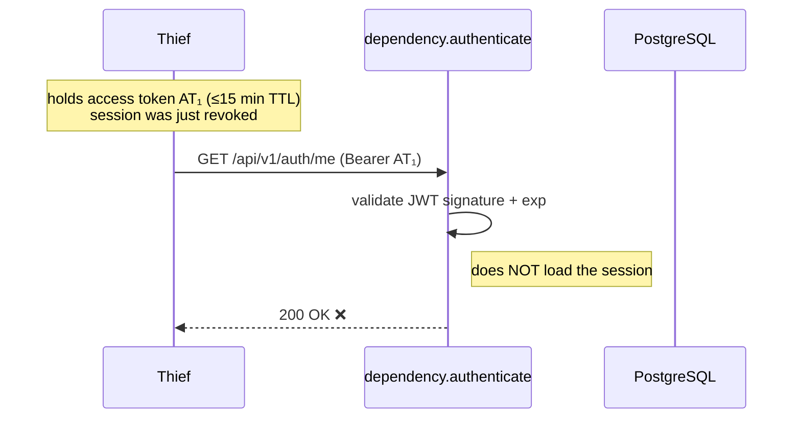
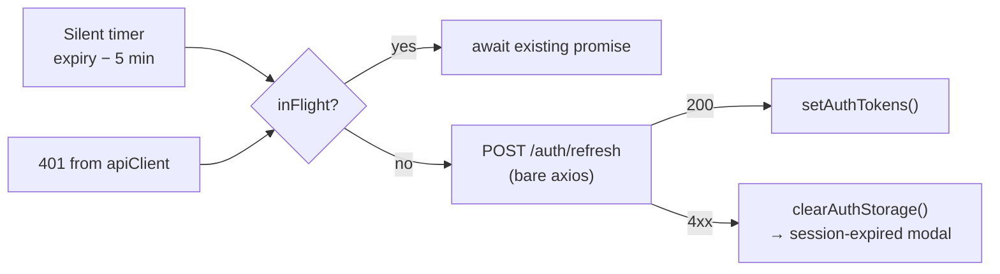

# Sequence — Token refresh, rotation, and reuse detection

> Traced from `AuthenticationService.refresh` and `frontend/src/services/tokenRefresh.ts`.
> This is the flow most likely to be probed in a security review.

## Normal rotation

```mermaid
sequenceDiagram
    autonumber
    participant SPA as Dashboard SPA
    participant R as auth/routes.py
    participant A as AuthenticationService
    participant RT as RefreshTokenService
    participant S as SessionService
    participant T as TokenService
    participant DB as PostgreSQL

    Note over SPA: timer fires 5 min before expiry,<br/>or a 401 arrives
    SPA->>R: POST /api/v1/auth/refresh {refresh_token}
    R->>A: refresh(token, ip, ua)

    A->>RT: find(plaintext)
    RT->>DB: SELECT … WHERE token_hash = sha256(plaintext)
    DB-->>RT: record | None
    Note over A: None → 401 INVALID_CREDENTIALS

    A->>RT: is_reuse(record)?
    Note over RT: revoked_at IS NOT NULL<br/>AND rotated_to_id IS NOT NULL
    RT-->>A: false

    A->>RT: is_valid(record)?  (not expired, not revoked)
    A->>DB: SELECT session
    A->>S: is_active(session)?
    A->>A: _assert_identity_active(user)

    A->>RT: rotate(record)
    RT->>DB: UPDATE old SET revoked_at, rotated_to_id
    RT->>DB: INSERT new refresh_token
    A->>S: touch(session) → last_seen_at
    A->>T: create_access_token(ctx)
    A->>DB: COMMIT + TOKEN_REFRESHED event
    A-->>SPA: 200 {access_token, refresh_token}

    SPA->>SPA: setAuthTokens(); reschedule timer
```

Rotation is unconditional: **every** use of a refresh token revokes it and issues
a successor, chained by `rotated_to_id`. A refresh token is therefore single-use.

## Reuse detection — the theft path

```mermaid
sequenceDiagram
    autonumber
    actor Thief
    participant SPA as Legitimate SPA
    participant A as AuthenticationService
    participant RT as RefreshTokenService
    participant S as SessionService
    participant EV as SecurityEventService
    participant DB as PostgreSQL

    Note over Thief,SPA: Thief has exfiltrated refresh token RT₁<br/>(e.g. XSS against localStorage)

    SPA->>A: refresh(RT₁)
    A->>RT: rotate(RT₁) → RT₂
    Note right of DB: RT₁: revoked_at set, rotated_to_id = RT₂
    A-->>SPA: 200 {RT₂}

    Note over Thief: replay of a rotated token
    Thief->>A: refresh(RT₁)
    A->>RT: find(RT₁) → record
    A->>RT: is_reuse(record)?
    RT-->>A: TRUE — revoked AND rotated

    rect rgb(60,20,20)
    Note over A,DB: Theft response
    A->>RT: revoke_session_family(session_id)
    RT->>DB: UPDATE refresh_tokens SET revoked_at WHERE session_id = …
    A->>S: revoke(session)
    S->>DB: UPDATE sessions SET revoked_at
    A->>EV: REFRESH_TOKEN_REUSED
    A->>DB: COMMIT
    end

    A-->>Thief: 401 REFRESH_TOKEN_REUSED
    Note over SPA: RT₂ is now dead too.<br/>Both parties must re-authenticate.
```



The design intent: a stolen refresh token is *useful only until the legitimate
client next refreshes*. At that moment the replay is detected and the session
dies for everyone. The victim is logged out — that is the correct, deliberate
trade: an interrupted session beats a silently hijacked one.

## Known gap: access tokens survive revocation ⚠️

Revoking the session stops **new** tokens. It does not invalidate the access
token already in the thief's hands.



`authenticate` validates the signature and expiry, and never touches the
`sessions` table. So after logout, session revocation, or reuse detection, an
already-issued access token keeps working until it expires:

| Surface | Worst-case window after revocation |
| ------- | ---------------------------------- |
| `/api/v1/auth` | **15 minutes** |
| Legacy `/auth/login` | **24 hours** (no session, no refresh, not revocable at all) |

This is the classic stateless-JWT trade-off, taken knowingly. Closing it costs a
session lookup (or denylist hit) on every authenticated request. Pinned by
`test_access_token_outlives_session_revocation_documented_gap` so it cannot
regress silently, and recorded in
[ADR-0003](../adr/0003-stateless-jwt-with-rotating-refresh-tokens.md).

## Client-side behaviour

`frontend/src/services/tokenRefresh.ts` coalesces concurrent refreshes into one
network round-trip via a module-level `inFlight` promise, and uses a **bare axios
instance** so a refresh can never recurse through the 401 interceptor.



Tokens live in `localStorage`, which is readable by any script on the origin.
This is a deliberate, documented risk — see
[threat model](../security/threat-model.md#i-information-disclosure).
