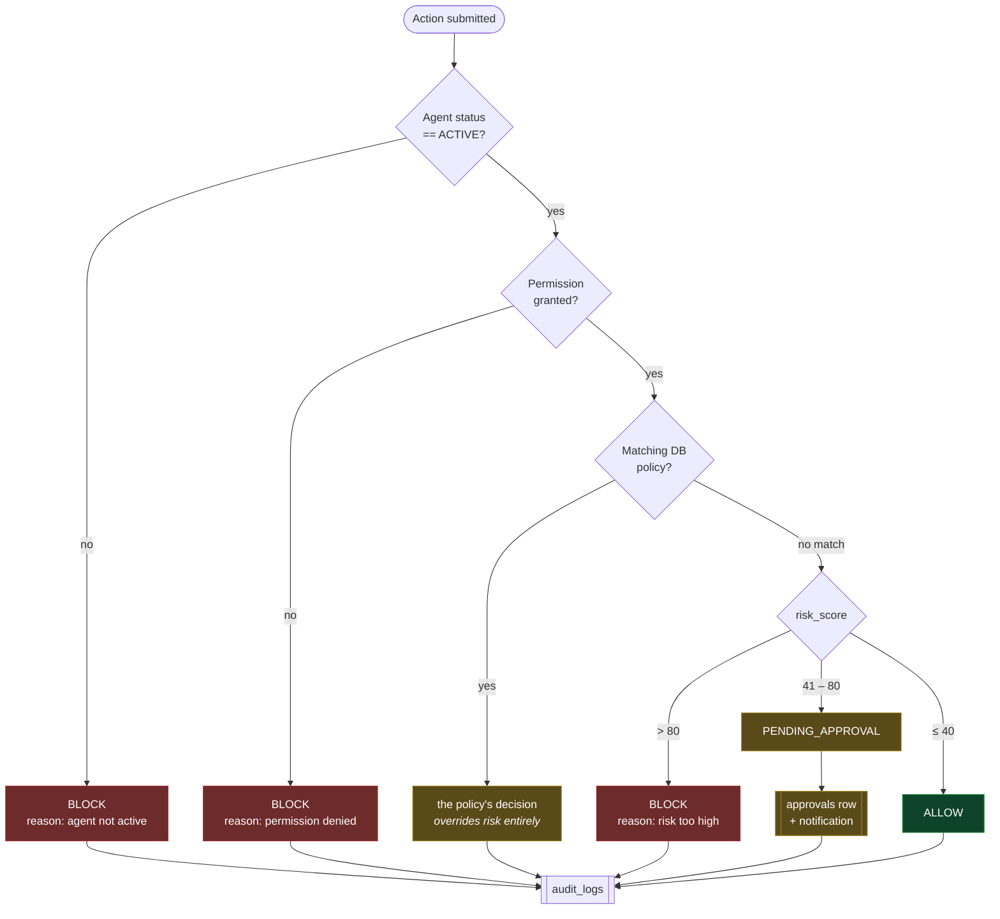
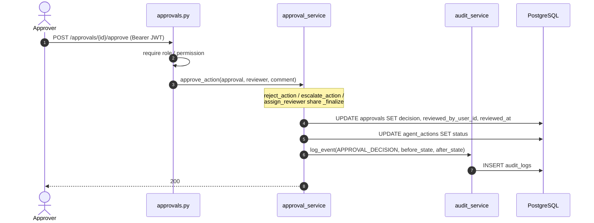

# Sequence — Agent action governance pipeline

> Traced from `services/agent_action_service.py::process_agent_action`.
> This is the product. Everything else exists to support this seven-step function.

## The pipeline

```mermaid
sequenceDiagram
    autonumber
    actor Ag as AI Agent
    participant R as agent_actions.py
    participant P as process_agent_action
    participant PE as permission_engine
    participant RE as risk_engine
    participant PolE as policy_engine
    participant DE as decision_engine
    participant AS as approval_service
    participant AU as audit_service
    participant NS as notification_service
    participant DB as PostgreSQL

    Ag->>R: POST /agent-actions {resource, action, input_payload}<br/>X-API-Key: agt_live_…
    R->>R: authenticate agent by key hash
    R->>P: process_agent_action(agent, resource, action, payload, ctx)

    P->>PE: check_permission(agent.id, resource, action)
    PE->>DB: SELECT permissions
    PE-->>P: allowed | denied

    P->>RE: calculate_risk_breakdown(resource, action, payload)
    Note right of RE: pure function →<br/>action_score + resource_score + modifiers
    RE-->>P: RiskBreakdown(score, breakdown)

    P->>PolE: evaluate_policies(org, resource, action, payload)
    PolE->>DB: SELECT policies WHERE enabled ORDER BY priority
    PolE-->>P: matched policy | none

    P->>DE: make_decision(agent, permission, risk, policy)
    Note right of DE: pure function — first decisive rule wins:<br/>status → permission → policy → risk thresholds
    DE-->>P: ALLOW / BLOCK / PENDING_APPROVAL + reason

    P->>DB: INSERT agent_actions (decision, risk_score, reason, status)

    rect rgb(20,40,25)
    Note over P,AU: ALWAYS audited — every decision, allow or block
    P->>AU: log_event(AGENT_ACTION_DECISION, before/after, risk_breakdown,<br/>matched_policy, ip, user_agent, request_id, trace_id)
    AU->>DB: INSERT audit_logs
    end

    alt decision == PENDING_APPROVAL
        P->>AS: create_pending_approval(agent_action)
        AS->>DB: INSERT approvals (priority, sla_due_at)
        AS->>NS: notify assignee
        NS-->>NS: SMTP or log (NOTIFICATIONS_ENABLED)
    end

    P-->>R: ProcessResult(action, approval, decision)
    R-->>Ag: 200 {decision, decision_reason, risk_score}
```

## Why this order

| Step | Why here |
| ---- | -------- |
| 1. Permission | Cheapest hard gate. An agent with no grant is refused regardless of risk. |
| 2. Risk score | Pure + cheap. Computed even when permission failed, so the audit record always carries a risk breakdown. |
| 3. Policy | DB read. Ordered by `priority` ascending; first match wins. |
| 4. Decision | Pure combination of agent status, 1, 3, and global risk thresholds. A matched policy **overrides** the risk score. |
| 5. Persist | The action row *is* the evidence. Written before the approval, so an approval can never reference a missing action. |
| 6. **Audit** | Unconditional. A blocked action is exactly as interesting to an auditor as an allowed one. |
| 7. Approval | Only for `PENDING_APPROVAL`. |

Steps 2 and 4 are pure functions. Given the persisted `input_payload` and the
policies in force, **the decision is reproducible** — you can replay any historical
`agent_actions` row and get the same answer. That property is what makes the audit
trail defensible, and it is the reason no LLM sits in this path
([ADR-0006](../adr/0006-deterministic-governance-pipeline.md)).

## Decision matrix

`decision_engine.make_decision` — **first decisive rule wins**:

Thresholds are module constants: `ALLOW_MAX_RISK = 40`, `APPROVAL_MAX_RISK = 80`.

### Configured-but-unused agent columns ⚠️

`agents.max_allowed_risk`, `human_approval_required`, `auto_suspend_threshold` and
`default_risk_score` are accepted by `POST /agents`, persisted, and surfaced in the
API — but **no engine reads them.** `make_decision` uses the two global constants
above, not per-agent configuration.

An operator can therefore set `human_approval_required=true` on an agent and it will
have no effect. This is a real gap between the data model's promise and the engine's
behaviour, not a documentation simplification — and it fails *silently*, because the
API accepts the value and reads it back. Wiring these into `decision_engine` is the
natural next step for per-agent risk posture.

## Approval resolution

Both the approval and the underlying action transition, and the pair is audited
with `before_state` / `after_state`. `approvals` carries `sla_due_at`,
`escalation_target`, and `escalated_at` for the escalation path.

## Trust posture

The agent is **untrusted**. Note what the pipeline does *not* do:

- It never executes the agent's action. It returns a decision; the agent acts.
- It never trusts `input_payload`. It is stored verbatim as JSONB for forensics
  and must be treated as hostile by every consumer, including the dashboard.
- It never lets an agent obtain a human session, a JWT, or a refresh token.

A prompt-injected agent and a buggy agent are indistinguishable at this boundary,
so the system is designed to make that distinction unnecessary.
