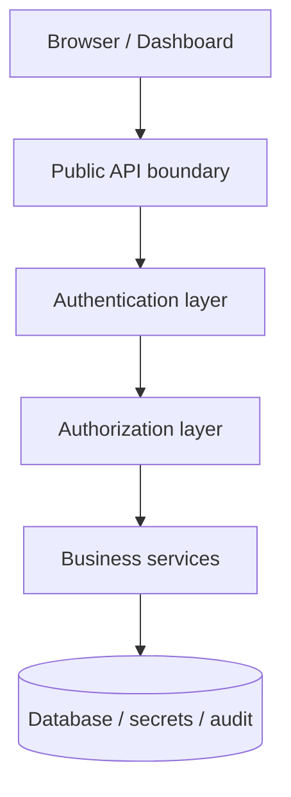
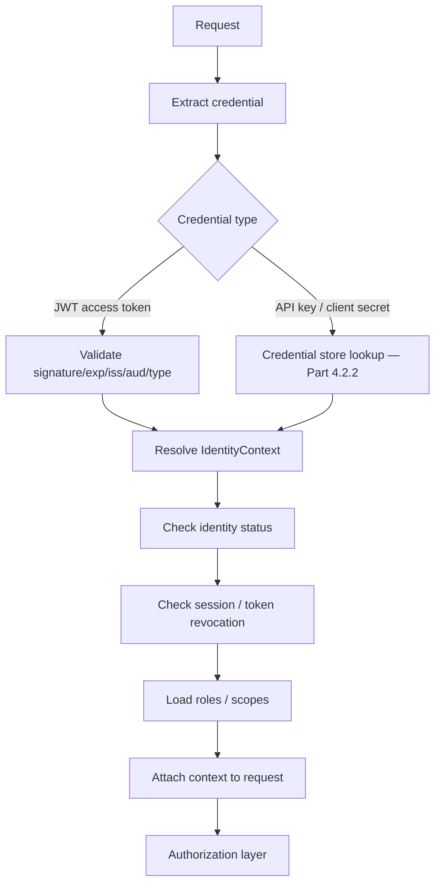

# Authentication Architecture (Phase 4 Part 4.2.1)

Status: **design + scaffolding**. This part establishes the architecture, the
`IdentityContext`, the core services and the middleware dependency. Token-table
persistence and the `/api/v1/auth/*` endpoints are implemented in Parts 4.2.2 /
4.2.3 (see [migration-plan.md](migration-plan.md)). The existing password login
keeps working unchanged — this is the foundation it migrates onto.

## Core principle (SRS §2)

Every request must answer: *who* is calling, *what type* of identity, *how* it
authenticated, *what* it may do, and *is the session/token still trusted* —
allow, challenge, or block.

## Identity types (SRS §3)

`HUMAN_USER` · `AI_AGENT` · `SERVICE_ACCOUNT` · `EXTERNAL_CLIENT` · `SYSTEM`
(`app/identity/auth/enums.py::AuthIdentityType`).

## Trust boundaries (SRS §4)



Nothing outside the authentication layer is trusted. Even a well-formed token is
validated for: signature, expiration, issuer, audience, token type, identity
status, session status, revocation status and permission scope
(`TokenService.validate_access_token` + the `authenticate` dependency).

## Components (SRS §16)

| Service | Responsibility | Module |
| ------- | -------------- | ------ |
| `AuthenticationService` | login / refresh / logout orchestration | `auth/authentication_service.py` |
| `TokenService` | create / decode / validate access tokens | `auth/token_service.py` |
| `RefreshTokenService` | issue / rotate / detect-reuse / revoke family | `auth/refresh_token_service.py` |
| `CredentialService` | password / API-key / client-secret verification | `auth/credential_service.py` |
| `SessionService` | create / touch / list / revoke sessions | `auth/session_service.py` |
| `SecurityEventService` | record authentication/security events | `auth/security_event_service.py` |
| `IdentityContextResolver` | validated credential → `IdentityContext` | `auth/resolver.py` |

## Authentication decision flow (SRS §8)



## IdentityContext (SRS §9)

Every authenticated request carries an `IdentityContext`
(`auth/context.py`) — services depend on it, never on raw tokens:

```python
IdentityContext(
    identity_id, identity_type, auth_method, organization_id,
    roles, permissions, scopes, session_id, credential_id,
    ip_address, user_agent, request_id,
    assurance_level, amr, mfa_pending,   # authentication assurance / MFA (§24)
)
```

`assurance_level` (`AAL0`/`AAL1`/`AAL2`), `amr` (auth-method references, e.g.
`["pwd","otp"]`) and `mfa_pending` are carried on the context **and** in the
access-token claims, so authorization and enterprise policies can require
step-up authentication without a redesign.

## MFA & step-up authentication (SRS §24)

The seam is complete and typed now; concrete factor verification + enrollment
storage land in a later subpart.

- **Assurance levels** — `AuthAssuranceLevel`: `AAL0` (primary factor verified,
  second factor pending), `AAL1` (single factor), `AAL2` (multi-factor).
- **Login is step-up-aware** — `AuthenticationService.login` calls the policy
  hook `_mfa_required(user)`. When it returns `True`, login stops **before**
  issuing a session/refresh token and returns a short-lived, `mfa_pending`
  challenge token (`AAL0`, TTL `AUTH_MFA_CHALLENGE_TTL_SECONDS`) plus
  `LoginResult.mfa_required=True`, recording `MFA_CHALLENGE_ISSUED`.
- **Completion** — `complete_mfa(challenge_token, method, code)` verifies the
  factor via `_verify_second_factor` (`MfaMethod`: TOTP/WebAuthn/SMS/email/
  recovery), then issues the real session + refresh token at `AAL2`
  (`amr=["pwd","totp"]`), recording `MFA_SUCCEEDED`; failure records `MFA_FAILED`
  and returns `MFA_REQUIRED`.
- **Enforcement** — `require_scope` rejects any `mfa_pending` (challenge) token;
  `require_assurance(AAL2)` gates sensitive routes on a satisfied second factor.
- **Today** — `_mfa_required` and `_verify_second_factor` return `False`, so
  login stays single-factor and behaviour is unchanged; enabling MFA is purely
  additive (flip the two hooks + add the enrollment table).

## Middleware (SRS §17)

`auth/dependency.py::authenticate` is a FastAPI dependency that extracts the
credential (`Authorization: Bearer <jwt>`, machine `Bearer agt_live_…`, or
`X-API-Key`), validates it, resolves the `IdentityContext`, and attaches it to
`request.state`. JWT access tokens are fully resolved today; machine-credential
resolution is dispatched but returns `API_KEY_INVALID` until the credential
store lands in Part 4.2.2, so machine auth cannot silently succeed. `require_scope`
gates a route on a scope/permission.

## Flows

**Login (§19):** validate password → *(if `_mfa_required` → issue MFA challenge,
stop; see MFA & step-up)* → create session → issue access + refresh token →
record `AUTH_LOGIN_SUCCESS`. Failures record `AUTH_LOGIN_FAILED` and return a
generic error (email existence is never revealed).

**Refresh (§20):** validate refresh token → rotate (revoke old, issue new) →
new access token → record `TOKEN_REFRESHED`. Replaying an already-rotated token
triggers reuse detection: the whole session family is revoked, the event
`REFRESH_TOKEN_REUSED` is recorded, and re-login is required.

**Logout (§21):** revoke session → revoke refresh-token family → record
`AUTH_LOGOUT`.

**Machine auth (§22):** hash presented key → find credential → check
status/expiry → resolve identity → record `API_KEY_USED` (wired in Part 4.2.2).

## Frontend architecture (SRS §18)

The dashboard already ships an `AuthContext`, `apiClient` bearer injection,
route guards and 401 handling. Phase 4 moves it toward: short-lived access token
in memory, refresh token in an HttpOnly cookie, silent refresh on 401 via
`/api/v1/auth/refresh`, and explicit logout. These are wired alongside the
backend endpoints in Part 4.2.2.

## Non-functional targets (SRS §26)

Access-token validation < 30 ms · API-key validation < 75 ms · login < 300 ms ·
refresh < 150 ms. Token validation is signature-only (no DB round-trip); session
and credential lookups are single indexed queries.
