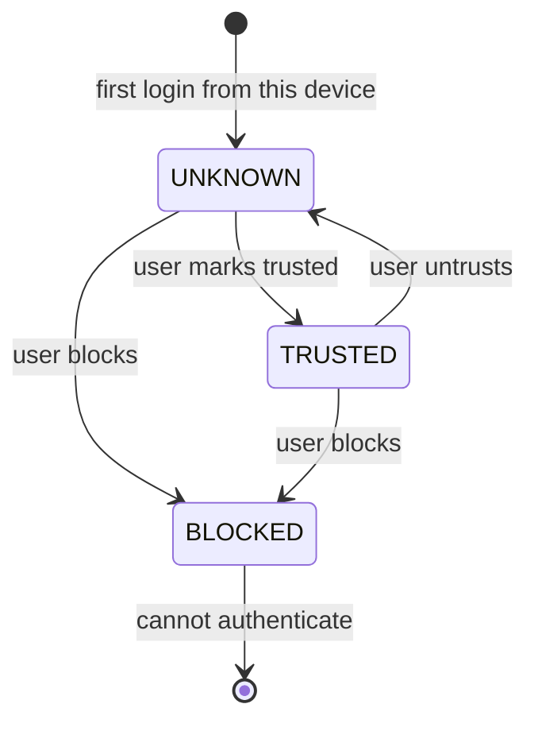

# Device Management (Phase 4 Part 4.2.2.2)

> A device is recognised, not authenticated. The fingerprint is derived from
> client-supplied data and can be forged.

## What a device is

Every login upserts a row in `auth_devices`, keyed by `(user_id, fingerprint)`.
The device carries a trust posture and drives both the security score and the
"where am I signed in?" UI.

| Column | Notes |
| ------ | ----- |
| `fingerprint` | SHA-256 of stable client characteristics (see below) |
| `device_name` | e.g. `Chrome on Windows 10/11` |
| `device_type` | `desktop` · `mobile` · `tablet` · `bot` · `unknown` |
| `browser`, `browser_version`, `operating_system` | Parsed from the User-Agent |
| `status` | `UNKNOWN` · `TRUSTED` · `BLOCKED` (SRS §14) |
| `last_ip`, `last_seen_at` | Updated on every login from this device |

## Fingerprinting (SRS §13)

```python
fingerprint_for(user_agent, device_id_header)
```

- If the client sends **`X-Device-Id`**, that value identifies the device. This
  lets one browser remain one device across User-Agent version bumps.
- Otherwise the fingerprint hashes the **parsed** User-Agent
  (`browser | operating_system | device_type`), **not** the raw string.

Hashing the parsed UA rather than the raw one is the important detail: a Chrome
patch release changes the raw User-Agent every few weeks. Fingerprinting the raw
string would register a brand-new device — and fire a "new device" security alert —
every time the browser auto-updated. Pinned by
`test_fingerprint_is_stable_across_patch_versions`.

### The fingerprint is not a credential

It is derived entirely from data the client controls, so it can be forged at will.
It is used to **recognise** a device for UX and risk scoring. It is never an
authentication factor on its own, and no authorization decision depends on it —
except `BLOCKED`, which can only ever *deny*, never grant.

### User-Agent parsing

Deliberately small: ~40 lines, no third-party dependency. We need a human-readable
label for the session list, not a forensic UA database. Unrecognised clients
degrade to `unknown` rather than guessing.

Browser matching is **ordered most-specific first**, because the UA string lies:

| Browser | Advertises |
| ------- | ---------- |
| Edge | `Edg/…` **and** `Chrome/…` **and** `Safari/…` |
| Chrome | `Chrome/…` **and** `Safari/…` |
| Safari | `Safari/…` |

Matching in declaration order (`Edg` → `OPR` → `Firefox` → `Chrome` → `Safari`)
avoids the classic mislabelling of Edge as Chrome. Pinned by
`test_edge_is_not_mistaken_for_chrome`.

## Trust posture (SRS §14)



| Status | Effect |
| ------ | ------ |
| `UNKNOWN` | Default. First login from the device incurs the new-device risk penalty. |
| `TRUSTED` | Absorbs the new-device penalty. The seam a future MFA policy uses to skip step-up. |
| `BLOCKED` | **Hard stop.** Login is refused with `DEVICE_BLOCKED` (HTTP 403). |

### Blocking revokes live sessions

`POST /api/v1/auth/devices/{id}/block` blocks the device **and revokes every active
session on it**, killing each session's refresh-token family.

Blocking without revoking would be theatre: the attacker keeps their current
session and merely cannot start a new one. Pinned by `test_device_trust_and_block`.

The UI refuses to block the device you are currently using — it would sign you out
instantly and lock you out of signing back in from it.

## Endpoints

| Method + Path | Purpose |
| ------------- | ------- |
| `GET /api/v1/auth/devices` | Known devices; `is_current` flags this one |
| `POST /api/v1/auth/devices/{id}/trust` | → `TRUSTED`, emits `DEVICE_TRUSTED` |
| `POST /api/v1/auth/devices/{id}/block` | → `BLOCKED` + revoke its sessions, emits `DEVICE_BLOCKED` |

Addressing another user's device returns a generic **404**.

## Geo-location

`country` / `city` / `timezone` are read from edge headers a reverse proxy or CDN
would set (`CF-IPCountry`, `X-Geo-*`). **No such proxy exists in the current
deployment**, so these are `NULL` and the new-country risk signal never fires.
Risk scoring degrades gracefully rather than guessing from the IP.

This is a real gap, not a design: it is unlocked by
[deployment gap 2](../architecture/deployment/deployment.md#gaps-before-production)
(no reverse proxy).

## Related

- [Session lifecycle](./session-lifecycle.md)
- [Token rotation](./token-rotation.md)
