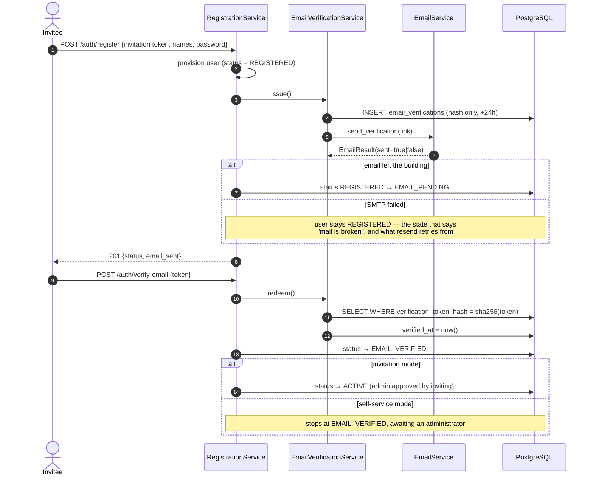

# Email Verification (Phase 4 Part 4.2.2.3.1)

> No account is activated until its owner proves control of the address. A 24-hour,
> single-use, hashed token is the proof.

## Flow (§12)



## The token

| Property | Value |
| -------- | ----- |
| Shape | `vrf_<43 url-safe chars>` — 32 bytes of `secrets.token_urlsafe` |
| Storage | SHA-256 hash only (`verification_token_hash`, unique) |
| Lifetime | 24 hours (`EMAIL_VERIFICATION_TTL_SECONDS`) |
| Uses | One |

## A resend supersedes; it does not accumulate

Issuing a new token stamps `superseded_at` on every outstanding one for that user.

Without this, "single use" quietly becomes "N simultaneous valid links", and a token
leaked from an old email stays redeemable forever. Pinned by
`test_resend_supersedes_the_previous_verification_token`.

Presenting a superseded token returns `INVALID_VERIFICATION_TOKEN` with the message
*"A newer verification link was sent. Please use the most recent email."* — because
the user did nothing wrong and telling them "invalid" would send them to support.

## Errors say what to do next (§18)

| Situation | Code | HTTP | What the UI offers |
| --------- | ---- | ---- | ------------------ |
| No such token | `INVALID_VERIFICATION_TOKEN` | 400 | Request a new link |
| Superseded by a newer link | `INVALID_VERIFICATION_TOKEN` | 400 | Use the most recent email |
| Past `expires_at` | `VERIFICATION_TOKEN_EXPIRED` | **410 Gone** | Request a new link |
| Already redeemed | `EMAIL_ALREADY_VERIFIED` | 409 | **Go and sign in** — this is success, not failure |

`EMAIL_ALREADY_VERIFIED` is rendered as a success state in the UI. A user who clicks
their link twice (or whose mail client prefetches it) has not made a mistake.

## Why `REGISTERED` and `EMAIL_PENDING` are different states

`notification_service.send_email` used to swallow every exception and return `None`, so
a caller could not tell a delivered message from a silently dropped one. It now returns
a boolean, and `EmailService` turns that into an `EmailResult`.

That distinction is load-bearing:

- **Email sent** → `EMAIL_PENDING`. The user has a link. Tell them to check their inbox.
- **Email failed** → stays `REGISTERED`. The account exists, the link does not.

The registration success page says *"Account created, but no email was sent"* in that
case, instead of telling the user to check an inbox for a message that was never
dispatched. A small lie there costs a support ticket and a lot of trust.

Sending is **best-effort and never rolls back the account**: losing the account because
a mail server hiccuped would be strictly worse than leaving it un-emailed.

## Enumeration safety (§14)

`POST /api/v1/auth/resend-verification` answers **identically** for an unknown address,
a pending one and an already-verified one:

```json
{ "message": "If that address needs verification, we have sent a new link." }
```

The UI must not imply that this message means the account exists. Rate limiting (5/min/IP)
slows enumeration; only a uniform response prevents it.

## When email delivery is off (the dev default)

`NOTIFICATIONS_ENABLED=false` **suppresses** sending. It does not discard the message.

An onboarding email carries the *only* copy of a single-use token — the database stores
nothing but its SHA-256. The original code logged the subject, threw the body away, and
returned "delivered", so every invitation created in development was permanently
unacceptable and its link unrecoverable. That is a data-loss bug wearing a config flag.

Suppressed messages are now appended, body and link included, to
`EMAIL_DEV_OUTBOX_PATH` (default `var/dev-outbox.log`, git-ignored):

```
==============================================================================
date:    2026-07-09T00:00:00+00:00
to:      ada@example.com
subject: You're invited to Acme
------------------------------------------------------------------------------
Accept your invitation:
http://localhost:5173/invite/inv_D-Dq9xLq2P_K2gGiQSZ0YwZAOcRNR5vbLMsBizGgZNo
```

The file holds plaintext tokens, so it is written **only** when delivery is disabled —
`outbox_path()` returns `None` the moment `NOTIFICATIONS_ENABLED=true`, and a test asserts
that a mail-sending deployment never produces it.

`GET /api/v1/identity/email-delivery` (`invitation.view`) reports `{enabled, outbox_path}`,
and the Invitations panel renders a warning when delivery is off. Without it a `PENDING`
invitation implies a message is in flight, and the invitee waits for ever.

## Tokens are never logged

`notification_service` logs the subject and recipients, never the body — and the body is
where the link lives. Our own failure logs redact the address (`a***@example.com`):
enough to correlate an incident, not enough to harvest.

## Audit (§13)

`EMAIL_VERIFICATION_SENT` · `EMAIL_VERIFIED` · `ACCOUNT_ACTIVATED` ·
`ACCOUNT_PENDING_APPROVAL`

Each records the target email, organization, request id, correlation id, IP and user
agent (§20), and is readable through the [security-event stream](./security-events.md).

## Changing an email address (Part 4.2.2.3.3 §12)

Changing the address on an account is a takeover vector, so it is gated three ways
(`EmailChangeService`):

1. **Re-authentication** — `POST /api/v1/auth/change-email` requires the current
   password again.
2. **Confirm the new address before it takes effect** — the confirmation link goes to
   the *new* address; `users.pending_email` holds it meanwhile, and the current
   `email` stays authoritative. A typo or hostile request cannot lock the owner out.
3. **Alert the old address** — when `POST /api/v1/auth/verify-new-email` swaps the
   address in, an alert is sent to the *old* mailbox, the one an attacker does not
   control.

The change reuses the `email_verifications` table with `purpose='EMAIL_CHANGE'` and
`new_email` set, so the same single-use/hashed/supersede discipline applies. Requesting
a change again supersedes the previous pending token. Errors:

| Situation | Code | HTTP |
| --------- | ---- | ---- |
| Wrong current password | `INVALID_CURRENT_PASSWORD` | 401 |
| New address already in use | `EMAIL_ALREADY_IN_USE` | 409 |
| Already your address | `INVALID_RECOVERY_REQUEST` | 400 |
| Confirmation link expired | `EMAIL_VERIFICATION_EXPIRED` | **410 Gone** |

Audited as `EMAIL_CHANGE_REQUESTED` → `EMAIL_CHANGE_VERIFIED` + `EMAIL_CHANGED`.

## Related

- [Registration](./registration.md)
- [Invitations](./invitations.md)
- [Recovery](./recovery.md)
- [Password reset](./password-reset.md)
