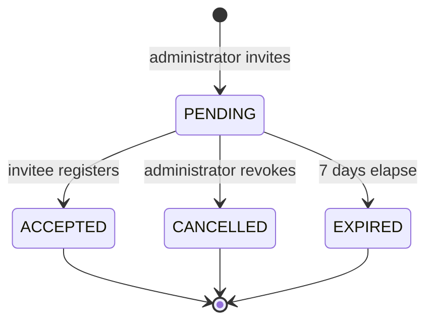

# Invitations (Phase 4 Part 4.2.2.3.1)

> Organizations control who joins. Every invitation is traceable, single-use, hashed
> at rest, and expires on its own.

## The token (§9, §14)

Requirements, verbatim: cryptographically random · single use · expires in 7 days ·
stored hashed · cannot be reused · never exposes internal IDs.

```
inv_<43 url-safe chars>          32 bytes of secrets.token_urlsafe
     ↓ sha256
invitations.token_hash           the only thing persisted
```

The plaintext exists in exactly two places: the email that was sent, and the URL the
user clicks. It is never stored, never logged, and never compared in Python — lookup
is one indexed read on the unique `token_hash`.

### Why not a JWT

§9's example link shows `/invite/eyJhbGciOi...`, which is a JWT. We use an **opaque
random token** instead, and the two are not interchangeable here:

- A JWT is self-describing. Anyone holding the link can base64-decode it and read the
  organization id, role id and inviter. §9's own requirement is that the link *"must
  never expose internal IDs"* — which a JWT does by construction.
- A JWT is *stateless*, which is the opposite of *single use*. Revoking one before its
  expiry needs exactly the server-side row we are already keeping.

The database row carries everything the link would otherwise have leaked. The public
preview endpoint returns organization **name**, role **name**, department **name** and
expiry — never ids.

## Lifecycle (§5)



`EXPIRED` is a **derived** fact the clock decides. `ACCEPTED` and `CANCELLED` are
**recorded** facts someone caused. Recorded facts win: a cancelled invitation does not
become "expired" merely because time passed.

The derived fact is **materialised on read** — `validate()` and
`list_for_organization()` both write the `EXPIRED` status before answering, so the
admin list and the accept path can never disagree about whether a link is alive. This
is the same discipline as session timeouts in Part 4.2.2.2.

## One live invitation per address

```sql
CREATE UNIQUE INDEX uq_invitations_pending_email
    ON invitations (organization_id, lower(email))
 WHERE status = 'PENDING'
```

A **partial** index: unique only among `PENDING` rows. A fresh invitation is therefore
allowed after an earlier one was cancelled, expired or accepted — while two live links
to the same mailbox are impossible.

`lower(email)` because `Ada@x.com` and `ada@x.com` are the same mailbox to every mail
server, and two invitations to "different" addresses that land in one inbox is a bug.

**Re-inviting is idempotent.** `POST /invitations` on an address with a live invitation
resends it with a rotated token rather than colliding with the index. From the
administrator's point of view, clicking invite twice does the obvious thing.

## Resend rotates the token (§7)

```
resend  →  new token minted, token_hash overwritten, expires_at reset,
           resent_count += 1, INVITATION_RESENT + INVITATION_SENT recorded
```

The **old link stops working**. Leaving it alive would mean a resend *adds* a valid
link rather than replacing one, and "single use" would quietly become "N uses". Pinned
by `test_resend_rotates_the_token_so_the_old_link_dies`.

The UI says so: *"New link sent. The previous link no longer works."*

## Cancel

`CANCELLED` is terminal and idempotent. Cancelling an already-accepted invitation is
refused with `INVITATION_ALREADY_USED` — the right action there is to suspend the
*user*, not to revoke a link that has already done its work.

## Dead links say which kind of dead (§18)

| Situation | Code | HTTP |
| --------- | ---- | ---- |
| No such token | `INVITATION_NOT_FOUND` | 404 |
| Past `expires_at` | `INVITATION_EXPIRED` | **410 Gone** |
| Already registered | `INVITATION_ALREADY_USED` | **410 Gone** |
| Revoked by an admin | `INVITATION_CANCELLED` | **410 Gone** |

410, not 404: the link *was* valid. The user needs to be told to ask for a new one, not
that they mistyped a URL.

And the reasons are distinguished, not collapsed into one generic error, because each
has a different next step — wait for a new invitation, ask the admin, or go and sign
in. Possession of an unguessable token already proves the holder was sent it, so
naming the reason reveals nothing they did not have.

## Audit (§13)

Every invitation action writes to `security_events`, readable through the
[audit stream](./security-events.md#reading-the-stream-dod-32-and-audit-user-sessions):

`INVITATION_CREATED` · `INVITATION_SENT` · `INVITATION_ACCEPTED` ·
`INVITATION_EXPIRED` · `INVITATION_CANCELLED` · `INVITATION_RESENT`

Each carries the target email, the acting administrator, the organization, the request
id, the correlation id, the IP address and the user agent (§20). A test greps the
sources for every one of these names, so an event type cannot become dead code — a
defect this codebase has produced repeatedly.

## If no email arrives

With `NOTIFICATIONS_ENABLED=false` (the dev default) nothing is sent. The link is written
to the [dev outbox](./email-verification.md#when-email-delivery-is-off-the-dev-default)
and the Invitations panel says so.

**A link that was never sent cannot be recovered from the database** — only its SHA-256 is
stored. Enable SMTP, then hit **Resend**, which mints a fresh token.

## Administrator UI

**Settings → Security → Invitations.** Invite by email, see status, resend, cancel.
Rendered only with `invitation.view`; the controls need `invitation.manage`.

The panel never receives a token — not even a prefix. An administrator has no business
holding the invitee's single-use credential. Pinned by
`InvitationsPanel › never renders a token, not even a prefix`.

## Related

- [Registration](./registration.md)
- [Email verification](./email-verification.md)
