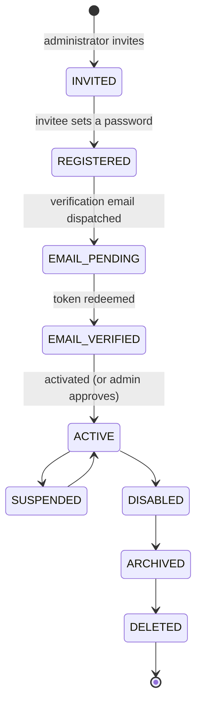

# Registration & Onboarding (Phase 4 Part 4.2.2.3.1)

> Authentication is only half of identity. This is the other half: how a human
> *becomes* a trusted identity. The enterprise default is **invitation only** —
> unrestricted public registration is the exception, not the rule.

## Registration modes (§3)

`organizations.registration_mode` — every existing organization was migrated to
`INVITE_ONLY`, because an upgrade must never silently open public registration.

| Mode | Who may join | Status |
| ---- | ------------ | ------ |
| `INVITE_ONLY` | Only invited addresses | **Default.** Implemented. |
| `ADMIN_ONLY` | Administrator creates the account directly | Implemented via `IdentityService.create_user` |
| `SELF_SERVICE` | Anyone, *then* verify email, *then* an admin approves | Implemented, opt-in |
| SSO provisioning | An IdP asserts the identity | Planned (§3 mode 4) |
| SCIM provisioning | An IdP creates accounts | Planned (§3 mode 5) |

`UserProvisioningService` is the seam SSO and SCIM will use. `ProvisionRequest.password`
is **optional**: passing `None` stores the `UNUSABLE_PASSWORD` sentinel, and
`verify_password` refuses it without raising — so an externally-authenticated identity
has no password credential and cannot acquire one by guessing. Those modes land without a
redesign, and `test_can_provision_an_identity_with_no_password` proves it today rather
than promising it.

Making the password optional did not make it unvalidated: when one *is* supplied,
`hash_user_password` enforces the full policy at the service layer (ADR-0004).

## Lifecycle (§4)

**Every state is persisted and observable.** The distinctions are not decorative:

| State | Meaning | Why it exists separately |
| ----- | ------- | ------------------------ |
| `INVITED` | An invitation exists; no `users` row yet | Carried by the `invitations` row |
| `REGISTERED` | Account exists, password set, **verification email not sent** | A user stays here when SMTP fails — precisely when an operator needs to see it, and what `resend-verification` retries from |
| `EMAIL_PENDING` | The email is out. Cannot sign in. | |
| `EMAIL_VERIFIED` | The address is proven | Terminal for **self-registration** until an administrator approves. In invitation mode the admin already approved by inviting, so activation follows in the same transaction (both transitions audited) |
| `ACTIVE` | May authenticate | |

Only `ACTIVE` can sign in. Everything else has a *reason*, and the login path says
which — see below.

### The login gate tells the user something useful

An invited user who has not verified their email must not be told *"this identity is
not permitted to authenticate"*. That is true and useless.

| Status | Error code | HTTP | Message |
| ------ | ---------- | ---- | ------- |
| `REGISTERED`, `EMAIL_PENDING`, `INVITED` | `EMAIL_NOT_VERIFIED` | 403 | "Confirm your email address before signing in." |
| `EMAIL_VERIFIED` | `ACCOUNT_PENDING_APPROVAL` | 403 | "An administrator must approve your account." |
| `SUSPENDED` | `IDENTITY_SUSPENDED` | 403 | |
| everything else | `IDENTITY_DISABLED` | 403 | |

403, not 401: the credential was correct. Re-entering the password cannot help.

## Registration never signs you in

`POST /api/v1/auth/register` returns **no tokens**. §12 requires the email address to
be verified before activation; handing back a session at registration would make
verification optional in practice, because the user would already be inside.

## The email comes from the invitation (§11)

The registration request body has **no email field**. It is read from the invitation
row. Accepting a caller-supplied address would let anyone holding a link register an
arbitrary address into the organization — pinned by
`test_registration_uses_the_invitation_email_not_a_supplied_one`.

## Password policy

The server is the only authority (see [ADR-0004](../architecture/adr/0004-single-source-password-policy.md)):
≥12 characters, four character classes, a common-password blocklist, and no email or
username substring. `UserProvisioningService` calls `hash_user_password`, so a weak
password is refused at the service layer, not merely at the HTTP boundary.

The frontend's strength meter (`modules/identity/passwordStrength.ts`) **mirrors** that
policy so the user learns what is missing before submitting. It is not a second gate:
a password the meter approves can still be refused with a 422, and the form renders
that server error rather than insisting it is fine.

## Enumeration safety (§14)

`POST /api/v1/auth/resend-verification` returns an identical acknowledgement for:

- an address that has never registered
- an address awaiting verification
- an address that is already verified

Rate limiting slows enumeration; only a uniform response prevents it. Pinned by
`test_resend_verification_never_reveals_whether_an_account_exists`.

The *authenticated* invitation endpoint does say "that email already belongs to a
user" — an administrator inviting into their own organization is not an attacker
probing for accounts, and the enumeration rule governs the public surface.

## Rate limiting (§19)

5 requests / minute / IP on every public endpoint: `register`, `register/self`,
`verify-email`, `resend-verification` and the invitation preview.

Postgres-backed (`rate_limit_hits`), not in-memory: an in-process counter resets on
every deploy and is silently wrong the moment a second replica exists. Redis is the
obvious home, but [ADR-0002](../architecture/adr/0002-postgresql-as-sole-datastore.md)
makes PostgreSQL the sole datastore, and 5 req/min over five endpoints is nowhere near
a workload that justifies a second one.

**Known limitation, stated plainly.** It is a *fixed* window, not a sliding one: a
caller can make 5 requests at the end of one window and 5 at the start of the next.
For an anti-abuse control on registration that is acceptable. The account lockout in
Part 4.2.2.1 is what actually protects the password, and that *is* a sliding window.

**The table cannot grow without bound.** Every `check` prunes its own bucket of rows the
window can no longer see, *and* reaps a bounded batch (`RATE_LIMIT_SWEEP_BATCH`, default
50) of globally stale rows. The second part matters: a caller rotating IP addresses
creates a bucket per address and never returns, so per-bucket pruning alone would leave
those rows for ever. The work per request is bounded, so no unlucky user absorbs a large
cleanup. `RateLimiter.sweep()` remains for an operator who wants the table empty *now*.

`X-Forwarded-For` is honoured only when `TRUST_PROXY_HEADERS=true`. Trusting it
unconditionally would let any caller spoof their bucket with a header, turning the
limiter into decoration. No such proxy exists in the current deployment
([deployment gap 2](../architecture/deployment/deployment.md#gaps-before-production)).

## API (§15)

| Method + Path | Auth | Rate limited |
| ------------- | ---- | ------------ |
| `POST /api/v1/auth/register` | public | ✅ |
| `POST /api/v1/auth/register/self` | public | ✅ |
| `POST /api/v1/auth/verify-email` | public | ✅ |
| `POST /api/v1/auth/resend-verification` | public | ✅ |
| `GET /api/v1/identity/invitations/{token}` | public | ✅ |
| `POST /api/v1/identity/invitations` | `invitation.manage` | — |
| `GET /api/v1/identity/invitations` | `invitation.view` | — |
| `POST /api/v1/identity/invitations/resend` | `invitation.manage` | — |
| `POST /api/v1/identity/invitations/cancel` | `invitation.manage` | — |
| `POST /api/v1/identity/users/{id}/approve` | `user.create` | — |

`invitation.view` and `invitation.manage` are separate codes: seeing who has been
invited is a lesser power than being able to invite, because an invitation is an offer
of access. Migration `0012` backfills both onto every existing SUPER_ADMIN and ADMIN
role — `seed_rbac` only runs at organization registration, so without the backfill
every existing admin would have received a 403 from the new endpoints.

### Expiry is reaped, not merely ignored

`InvitationService.list_for_organization` reaps the **whole organization's** expired
invitations before answering — not just the rows on the page. Materialising only the
current page would leave the database disagreeing with itself the moment an administrator
filtered or paginated: a row absent from that response would stay `PENDING` for ever while
its clock had long run out. `validate()` still handles a single expired link lazily, so no
read path can ever see a live-looking corpse.

## Data model (§5)

| Table | Purpose |
| ----- | ------- |
| `invitations` | One live invitation per `(organization, email)`, enforced by a **partial** unique index on `PENDING` rows only — so a fresh invitation is allowed after cancellation or expiry |
| `email_verifications` | Single-use, hashed, 24-hour tokens |
| `user_profiles` | Profile kept out of `users`, which is the *security* record |
| `rate_limit_hits` | Fixed-window counter |

`user_profiles` exists because `users` carries credentials, status and tenancy — the
row the authentication path reads on every request. An avatar change should not touch it.

## Related

- [Invitations](./invitations.md) — tokens, expiry, resend semantics
- [Email verification](./email-verification.md)
- [Session lifecycle](./session-lifecycle.md)
- [ADR-0004](../architecture/adr/0004-single-source-password-policy.md) — one password policy
