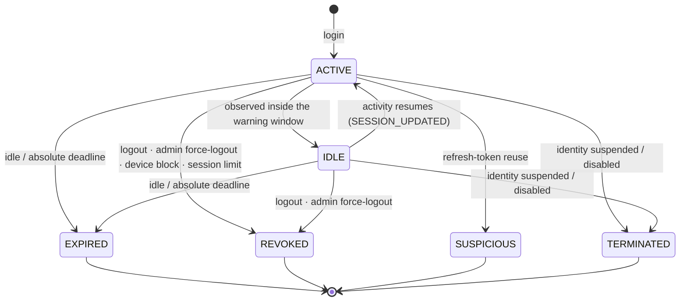

# Session Lifecycle (Phase 4 Part 4.2.2.2)

> **A session is not a JWT.** The JWT is disposable; the row in `auth_sessions` is
> the source of truth. Every authenticated request revalidates it.

## Why this matters

Before 4.2.2.2, `authenticate` verified a JWT's signature and expiry and never
looked at the database. Logout, admin force-logout and even detected token theft
left the already-issued access token working for up to 15 minutes. That is the
default posture of most "JWT auth" tutorials, and it is why so many products get
session management wrong.

The session is now loaded and revalidated on **every** authenticated request, on
*both* authentication dependencies — the `/api/v1/auth` surface and the legacy one
that still serves the dashboard, agents, policies, approvals, audit and the identity
admin API. The cost is one primary-key lookup (SRS §28 budget: <20ms). What it buys:

| Action | Before | Now |
| ------ | ------ | --- |
| Logout | token lives ≤15 min | **immediate** |
| Admin force-logout | ≤15 min | **immediate** |
| Refresh-token reuse detected | ≤15 min | **immediate** |
| Idle timeout | not enforced | **enforced (30 min)** |
| Absolute timeout | not enforced | **enforced (12 h)** |
| Device blocked | not enforced | **immediate** |

See [ADR-0007](../architecture/adr/0007-stateful-session-validation.md), which
supersedes the stateless hot-path decision in ADR-0003.

## States (SRS §4)

`CREATED` (SRS §4) is **never persisted**: a session is born `ACTIVE`, and there is
no moment between creation and the login response in which it could be observed. It
is retained in the enum because the SRS names it, and because a future pre-MFA
"created but not yet elevated" session would land there. Every other state is
reachable and asserted by a test.

`TERMINATED` is the *final* state, distinct from `REVOKED`: a revoked session is one
the user could replace by signing in again; a terminated one belongs to an identity
that is no longer permitted to authenticate at all.

**`IDLE` is the warning window**, not a dead state: the session has seen no activity
for long enough that expiry is imminent (`idle_expires_at − SESSION_IDLE_WARNING_SECONDS`),
but it is still usable. It is discovered by *observing* a session — listing it, or
reaping — never by the session making a request, because a request is by definition
activity. Using an idle session resumes it to `ACTIVE` and emits `SESSION_UPDATED`.

Two kinds of fact live on a session:

- **Recorded** — `status`, `revoked_at`, `revoked_reason`. *Someone did this.*
- **Derived** — `idle_expires_at`, `absolute_expires_at`. *The clock did this.*

`SessionLifecycleService.assert_usable` reconciles them on every read. When the
clock has run out, the session is **materialised** to `EXPIRED` and the expiry is
committed *before* the error is raised — otherwise the request's error handler
would roll it back, and the hot path and the session-listing endpoint would report
different truths about the same session.

Recorded terminal states win over derived ones. A revoked session does not become
"expired" merely because time passed: the reason it died must survive.

## Timeouts (SRS §12)

| Setting | Default | Meaning |
| ------- | ------- | ------- |
| `SESSION_IDLE_TIMEOUT_SECONDS` | 30 min | No request for this long → unusable |
| `SESSION_ABSOLUTE_TIMEOUT_SECONDS` | 12 h | Hard ceiling regardless of activity |
| `SESSION_REMEMBER_ME_SECONDS` | 7 d | Replaces the *absolute* ceiling only |
| `SESSION_IDLE_WARNING_SECONDS` | 5 min | Client warns the user before expiry |
| `SESSION_MAX_CONCURRENT` | 5 | Oldest session evicted past the limit |
| `SESSION_ACTIVITY_WRITE_INTERVAL_SECONDS` | 60 | Throttle on `last_activity_at` writes |

**"Remember me" extends the absolute ceiling, never the idle timeout.** An
abandoned laptop is still an abandoned laptop. A session that has not been touched
for 30 minutes dies whether or not the user ticked the box.

When both deadlines have passed, the failure is reported as `ABSOLUTE_TIMEOUT` —
the stronger statement.

### The activity-write throttle

The idle deadline is *evaluated* on every request, but `last_activity_at` is only
*written* once per `SESSION_ACTIVITY_WRITE_INTERVAL_SECONDS`. Without this, a busy
client turns a read-mostly hot path into a write-mostly one and its concurrent
requests contend on a single row.

The cost: the effective idle timeout can overshoot by up to the throttle interval
(60 s on a 30-minute timeout). That is an acceptable trade and it is deliberate.

## Revocation reasons (SRS §20)

Always recorded alongside `revoked_at` — *when* without *why* is useless in an
incident review.

`USER_LOGOUT` · `ADMIN_REVOKED` · `PASSWORD_RESET` · `SECURITY_EVENT` ·
`ACCOUNT_DISABLED` · `TOKEN_REUSE` · `SESSION_LIMIT_EXCEEDED` · `IDLE_TIMEOUT` ·
`ABSOLUTE_TIMEOUT`

Revocation is **idempotent**, and re-revoking keeps the *original* reason: the
first cause of death is the interesting one.

## Concurrent sessions & the limit (SRS §10, §11)

Every device gets its own session and its own refresh-token family. Revoking one
never touches another.

The limit is enforced **before** the new session is created, so the user ends up
*at* the limit rather than one over it. The oldest active session is revoked with
`SESSION_LIMIT_EXCEEDED`, and its refresh-token family dies with it.

## Security score (SRS §15)

Starts at 100; each risk signal subtracts.

| Signal | Penalty | Setting |
| ------ | ------- | ------- |
| New device | 20 | `SESSION_SCORE_NEW_DEVICE_PENALTY` |
| New country | 20 | `SESSION_SCORE_NEW_COUNTRY_PENALTY` |
| Refresh-token reuse | 80 | `SESSION_SCORE_TOKEN_REUSE_PENALTY` |

Bands: **80–100** healthy · **50–79** warning · **0–49** high risk.

Two deliberate rules:

1. **A user's first-ever login scores 100.** "New" is only meaningful against a
   baseline; on the first login every device and country is new by definition.
   Scoring it as risky would flag every new account and train operators to ignore
   the signal.
2. **A trusted device absorbs the new-device penalty.**

**The score is advisory.** It drives the UI badge and notifications. Only two
things actually *block* a session — a `BLOCKED` device and refresh-token reuse —
and both are hard rules, not score thresholds. A security control that can be
tuned away by adjusting a weight is not a control.

## Endpoints (SRS §23)

### Self-service — `/api/v1/auth/*`, scoped to the caller

| Method + Path | Purpose |
| ------------- | ------- |
| `POST /api/v1/auth/login` | Create a session (+ device, + token family) |
| `POST /api/v1/auth/logout` | Revoke current session, or all (`all_devices`) |
| `POST /api/v1/auth/refresh` | Rotate the refresh token |
| `GET /api/v1/auth/sessions` | Caller's active sessions; `is_current` flags this one |
| `GET /api/v1/auth/sessions/{id}` | One session + its refresh-token family |
| `POST /api/v1/auth/sessions/{id}/revoke` | Force-logout one session |
| `DELETE /api/v1/auth/sessions/{id}` | Alias of revoke (sessions are never hard-deleted) |
| `GET /api/v1/auth/devices` | Known devices |
| `POST /api/v1/auth/devices/{id}/trust` | Mark trusted |
| `POST /api/v1/auth/devices/{id}/block` | Block + revoke its live sessions |

### Administrative — `/api/v1/identity/*`, org-scoped, permission-gated (SRS §17, §32)

| Method + Path | Permission |
| ------------- | ---------- |
| `GET /api/v1/identity/sessions?user_id=` | `session.view` |
| `GET /api/v1/identity/sessions/{id}` | `session.view` |
| `POST /api/v1/identity/sessions/{id}/revoke` | `session.revoke` |
| `POST /api/v1/identity/users/{user_id}/sessions/revoke-all` | `session.revoke` |
| `GET /api/v1/identity/users/{user_id}/devices` | `session.view` |
| `GET /api/v1/identity/security-events` | `session.view` |
| `GET /api/v1/identity/security-events/types` | `session.view` |
| `GET /api/v1/identity/sessions/{id}/events` | `session.view` |

### Self-service audit — the caller's own activity

| Method + Path | Purpose |
| ------------- | ------- |
| `GET /api/v1/auth/security-events` | The caller's own events. Never accepts an `actor_id`. |

The security-event stream is gated on **`session.view`, not `audit.view`**. Every
built-in role — including `VIEWER` — holds `audit.view`, and this stream carries other
people's IP addresses, devices and login history. If you may see whose sessions exist,
you may see their events; otherwise you may not.

`session.view` and `session.revoke` are granted to `SUPER_ADMIN` and `ADMIN`
(migration `0010` backfills existing organizations). They are deliberately separate
codes: reading who is signed in where is a lesser power than forcibly ending
someone's session.

Admin force-logout is **distinct from disabling the account**. Disabling an identity
also revokes its sessions (`ACCOUNT_DISABLED`), but leaves the user unable to sign
back in. `revoke-all` ends the sessions and lets them sign in again — the right
response to a suspected credential leak followed by a password reset.

Every admin revocation records the actor (`actor_id`, `actor_email`) alongside the
subject. An audit record of a force-logout that omits who pulled the trigger is not
an audit record.

Addressing another user's session or device — from self-service, or from another
organization — returns a generic **404**. "Not yours" and "does not exist" must be
indistinguishable.

## Error codes (SRS §27)

| Code | HTTP | When |
| ---- | ---- | ---- |
| `SESSION_NOT_FOUND` | 404 | Unknown, or not the caller's |
| `SESSION_REVOKED` | 401 | Logged out / admin-revoked / terminated |
| `SESSION_EXPIRED` | 401 | Absolute ceiling reached |
| `SESSION_IDLE_TIMEOUT` | 401 | Idle deadline reached |
| `SESSION_SUSPICIOUS` | 401 | Flagged by a security signal (e.g. token reuse) |
| `DEVICE_BLOCKED` | **403** | Credential was correct; the *device* is refused |
| `TOKEN_REUSE` / `REFRESH_TOKEN_REUSED` | 401 | Replayed refresh token |
| `TOO_MANY_SESSIONS` | 409 | Reserved for a future hard-limit policy |
| `INVALID_REFRESH_TOKEN` | 401 | No such token |

`DEVICE_BLOCKED` is a 403, not a 401: the password was right, so re-authenticating
cannot help. The distinction matters to the client, which must not prompt for
credentials again.

## Audit events (SRS §26)

All twelve are **emitted**, not merely defined. `test_every_srs_26_event_type_is_reachable`
greps production sources for each and fails if one becomes dead code again — an
event type that exists only in an enum is worse than no event type, because the
documentation implies coverage that isn't there.

| Event | Emitted when | By |
| ----- | ------------ | -- |
| `SESSION_CREATED` | login | `AuthenticationService` |
| `SESSION_UPDATED` | `IDLE` → `ACTIVE` on resumed activity | `SessionLifecycleService.touch` |
| `SESSION_REVOKED` | logout, admin force-logout, device block, account disabled | callers |
| `SESSION_EXPIRED` | the state the session entered | `SessionLifecycleService._expire` |
| `SESSION_TIMEOUT` | *which clock ran out* (idle vs absolute) | `SessionLifecycleService._expire` |
| `SESSION_SUSPICIOUS` | the state the session entered on token reuse | `SessionSecurityService.flag_token_reuse` |
| `SESSION_LIMIT_EXCEEDED` | oldest session evicted | `AuthenticationService.login` |
| `DEVICE_REGISTERED` | first login from a device | `AuthenticationService.login` |
| `DEVICE_TRUSTED` | user trusted a device | `auth/routes.py` |
| `DEVICE_BLOCKED` | device blocked, or a blocked device tried to log in | `auth/routes.py`, `login` |
| `TOKEN_ROTATED` | refresh token rotated | `AuthenticationService.refresh` |
| `TOKEN_REUSE_DETECTED` | forensic anchor on the replayed token | `AuthenticationService` |

### Reading the stream

Events are written to `security_events` and **deliberately not mirrored into
`audit_logs`** (`mirror_to_audit_log=False`) — authentication is its own stream. That
made them unreadable until Part 4.2.2.2 added a read path; an audit event nobody can
read is not an audit trail.

The queries that matter are indexed (migration `0011`):

| Question | Index |
| -------- | ----- |
| "the org's events, newest first" | `(organization_id, created_at DESC)` |
| "everything this identity did" | `(actor_id, created_at DESC)` |
| **"who revoked this session, when, and why?"** | expression index on `(meta ->> 'session_id')` |
| "every `TOKEN_REUSE_DETECTED` this month" | `(event_type, created_at DESC)` |

The session-history query uses the JSONB **expression** index — the repository filters
with `meta['session_id'].astext`, not a containment operator, because only the text
extraction can use it.

Two pairs fire together, deliberately:

- **`SESSION_TIMEOUT` + `SESSION_EXPIRED`** — the *cause* and the *effect*. An
  analyst filtering for expiries and one filtering for timeouts are asking
  different questions, and both must find the event.
- **`TOKEN_REUSE_DETECTED` + `SESSION_SUSPICIOUS`** — what happened to the *token*
  and what happened to the *session*.

`SESSION_UPDATED` is emitted **only on the `IDLE` → `ACTIVE` transition**, never on
the sliding idle deadline. Auditing every touch would write one security event per
user per minute, forever, and drown the stream it belongs to. Pinned by
`test_session_updated_is_not_emitted_on_every_request`.

## Related

- [Token rotation](./token-rotation.md) — families, rotation, reuse detection
- [Device management](./device-management.md) — fingerprinting and trust
- [Token strategy](./token-strategy.md)
- [ADR-0007](../architecture/adr/0007-stateful-session-validation.md)
