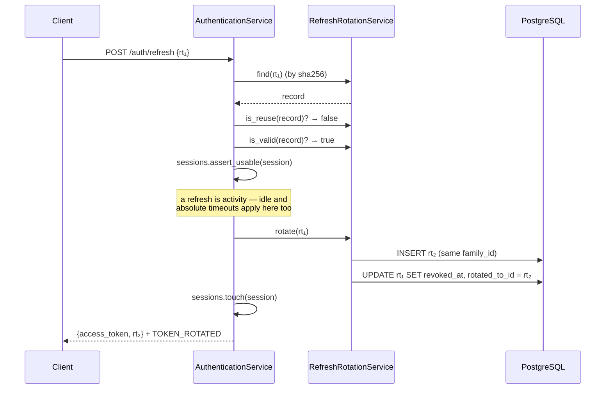

# Token Rotation & Reuse Detection (Phase 4 Part 4.2.2.2)

> Every refresh token is single-use. Replaying one is treated as theft.

## The three rules

1. **A refresh token is single use.** Every presentation rotates it: a successor is
   issued, the predecessor is revoked, and the two are linked by `rotated_to_id`.
2. **An already-rotated token presented again is a replay.** Only two parties can
   hold it — the legitimate client and a thief — and the legitimate client has
   already moved on to its successor. Kill the family *and* the session.
3. **The plaintext is never stored, never logged, never compared in Python.** Only
   `sha256(token)` is persisted; lookup is by hash on an indexed column.

## Families (SRS §7)

One session owns exactly one refresh-token family.

```
auth_sessions.refresh_token_family_id ──┐
                                        ├─→ refresh_tokens.family_id
  rt₁ ──rotated_to_id──▶ rt₂ ──rotated_to_id──▶ rt₃  (live)
  (revoked)              (revoked)
```

`family_id` is denormalised onto `refresh_tokens` so a reuse sweep never needs a
join, and so a family survives forensically even if its session row is removed.

## Rotation



## Reuse detection (SRS §9)

```mermaid
sequenceDiagram
    actor T as Thief
    participant C as Legitimate client
    participant A as AuthenticationService
    participant DB as PostgreSQL

    Note over T,C: both hold rt₁ (stolen via XSS, backup, log leak…)
    C->>A: refresh(rt₁) → rt₂    (rt₁ now revoked + rotated)
    T->>A: refresh(rt₁)          (replay)
    A->>A: is_reuse(rt₁) → TRUE

    rect rgb(60,20,20)
    A->>DB: mark rt₁.reuse_detected_at
    A->>DB: revoke entire family (incl. rt₂)
    A->>DB: session → SUSPICIOUS, score −80, reason TOKEN_REUSE
    A->>DB: TOKEN_REUSE_DETECTED + REFRESH_TOKEN_REUSED events
    end

    A-->>T: 401 REFRESH_TOKEN_REUSED
    Note over C: rt₂ is dead too. Both must sign in again.
```



The victim is logged out along with the thief. **This is deliberate.** An
interrupted session is strictly better than a silently hijacked one. It is also
why reuse marks the session `SUSPICIOUS` rather than merely `REVOKED`: an incident
reviewer must be able to tell theft apart from a routine logout.

### Why `is_reuse` requires *both* conditions

```python
return record.revoked_at is not None and record.rotated_to_id is not None
```

A token that is merely revoked — by logout, by an admin, by the session limit —
was never rotated, so nobody raced anybody. Without the `rotated_to_id` condition
**every logout would be reported as a token theft**, and the alert would be
worthless. Pinned by `test_logout_is_not_reported_as_token_reuse`.

## Forensics

After reuse, the family tells the whole story:

| Column | Meaning |
| ------ | ------- |
| `family_id` | Which session's chain |
| `rotated_to_id` | The successor — walk it to reconstruct the chain |
| `revoked_at` | When each link died |
| `reuse_detected_at` | The exact token that was replayed |

`RefreshRotationService.family_chain(family_id)` returns the chain oldest-first.

## Lifetimes

| Token | Lifetime | Storage | Revocable |
| ----- | -------- | ------- | --------- |
| Access (JWT) | 15 min | none (stateless claims) | **yes** — session checked per request |
| Refresh (`rt_…`) | 7 d | `sha256` hash only | yes (family revocation) |

Since Part 4.2.2.2 the access token is effectively revocable, because
`authenticate` revalidates the session behind it on every request. See
[session-lifecycle.md](./session-lifecycle.md) and
[ADR-0007](../architecture/adr/0007-stateful-session-validation.md).

## Residual risk

Refresh tokens are stored in browser `localStorage`, so an XSS on the dashboard
origin yields a 7-day credential. Rotation bounds the blast radius — the thief is
evicted the moment the real client refreshes, and vice versa — but it does not
prevent the initial theft. Moving to an `httpOnly` cookie plus CSRF protection is
tracked in the [threat model](../architecture/security/threat-model.md).
