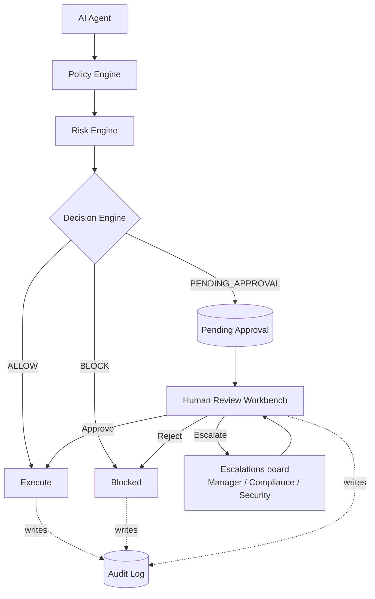
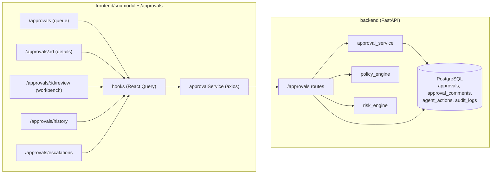

# Phase 3 — Part 3.4: Approval Queue & Human Review Workbench

This document records what was delivered in Part 3.4 against the SRS (v0.3.0):
the operational heart of AI governance, where humans inspect, approve, reject,
escalate and audit AI agent decisions.

## Governance flow (where this module sits)

Every decision — request, view, comment, assign, escalate, approve, reject —
writes an `audit_logs` entry, which powers the review timeline.

## Frontend ↔ backend data flow

## Endpoint → UI map

| UI surface | Endpoint(s) | RBAC code |
| ---------- | ----------- | --------- |
| Statistics cards | `GET /approvals/statistics` | `approval.view` |
| Queue table + filters/search | `GET /approvals?status&priority&risk_min&risk_max&search` | `approval.view` |
| Details (agent/policy/risk/payload/comments) | `GET /approvals/{id}` | `approval.view` |
| Decision timeline | `GET /approvals/{id}/timeline` | `approval.view` |
| Comment thread | `GET`/`POST /approvals/{id}/comments` | view / `approval.review` |
| Approve | `POST /approvals/{id}/approve` | `approval.review` |
| Reject (≥20-char reason) | `POST /approvals/{id}/reject` | `approval.review` |
| Escalate (target + reason) | `POST /approvals/{id}/escalate` | `approval.escalate` |
| Assign / reassign reviewer | `POST /approvals/{id}/assign` | `approval.assign` |
| History | `GET /approvals/history?status&search` | `approval.view` |
| Escalations board (SLA countdown) | `GET /approvals/escalations` | `approval.view` |

## Data model changes (migration `0005_approval_workbench`)

- `approvals.assigned_to_user_id` — FK → `users` (the responsible reviewer).
- `approvals.escalation_target` — who it was escalated to.
- `approvals.escalated_at` — escalation timestamp.
- `approval_decision` enum gains `ESCALATED` and `EXPIRED`.
- New RBAC permission codes: `approval.view`, `approval.escalate`,
  `approval.assign` (Reviewers get review + escalate + assign; Viewers get
  read-only `approval.view`).

## Definition of Done — status

| # | Acceptance criterion | Status |
| - | -------------------- | ------ |
| 1 | Approval dashboard loads backend data | ✅ |
| 2 | Statistics cards work | ✅ |
| 3 | Search and filters work | ✅ |
| 4 | Approval details page complete | ✅ |
| 5 | Review Workbench functional | ✅ |
| 6 | Approve flow works | ✅ (requires note) |
| 7 | Reject flow requires reason | ✅ (≥20 chars) |
| 8 | Escalate flow works | ✅ (target + reason) |
| 9 | Request payload viewer works | ✅ (copy/download/collapse) |
| 10 | Risk breakdown renders | ✅ (recharts pie) |
| 11 | Timeline records review events | ✅ (audit-derived) |
| 12 | Comments persist | ✅ |
| 13 | Export works | ✅ (CSV + JSON) |
| 14 | Role-based UI restrictions enforced | ✅ (UI hides; backend enforces) |
| 15 | Loading / empty / error states | ✅ |
| 16 | No TypeScript errors | ✅ (`tsc -b`) |
| 17 | No console errors | ✅ (headless-Chrome drive across all 5 pages — 0 events) |
| 18 | README & architecture docs updated | ✅ (root + frontend README, ROADMAP, this doc) |

## Runtime verification

Verified by driving the running app (backend on `:8002`, Vite dev on `:5173`)
with headless Chrome:

- All five pages render real backend data with **zero** console errors,
  page errors or failed requests.
- End-to-end **escalate** through the UI: `POST /approvals/{id}/escalate` →
  `200`, and the approval appears on the escalations board with a live SLA
  countdown.
- Reject/escalate dialogs gate their confirm button until validation passes
  (empty reason → disabled).

Backend covered by `tests/test_approvals_part34.py` (queue/filter/search,
statistics, detail, escalate→decide, assign+timeline, history); frontend by
`src/modules/approvals/tests/` (table + role-based UI, reject validation,
formatters).
