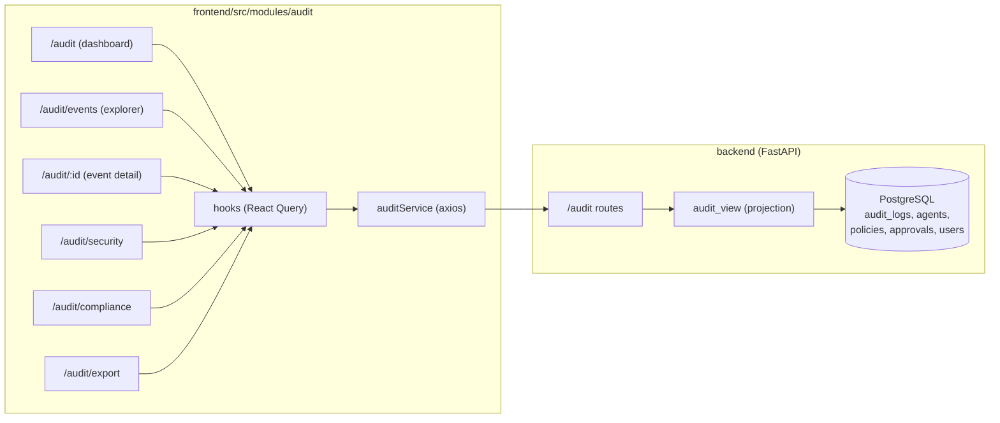

# Phase 3 — Part 3.5: Enterprise Audit & Compliance Center

This document records what was delivered in Part 3.5 against the SRS (v0.3.0): a
centralized module that records, visualizes, searches, exports and explains every
significant event inside the AI Agent Control Tower — in the spirit of Microsoft
Purview, Splunk, Elastic Kibana, Azure Monitor and Datadog Logs.

Every important action answers: **who** performed it, **which** agent/user, **what**
happened, **when**, **why**, **which policy** was involved, **what** the result was,
and **can we reproduce the decision**.

## Design principle: derive, don't duplicate

The module is a read-only projection over the existing immutable `audit_logs`
trail. Severity, category, decision, human status and actor names are *derived*
on the backend (`app/services/audit_view.py`) — no new columns or tables. The
related-events flow is reconstructed from the shared `request_id` / `trace_id`
(correlation id) already written by Phase 2's forensic audit.

## Frontend ↔ backend data flow



## Endpoint → UI map

| UI surface | Hook | Endpoint | Permission |
| ---------- | ---- | -------- | ---------- |
| Dashboard statistics cards | `useAuditStatistics` | `GET /audit/statistics` | `audit.view` |
| Dashboard timeline | `useAuditTimeline` | `GET /audit/timeline` | `audit.view` |
| Dashboard recent events / explorer table | `useAudit` | `GET /audit` | `audit.view` |
| Filter dropdown catalog | `useAuditEventTypes` | `GET /audit/events` | `audit.view` |
| Event detail (+ related events) | `useAuditEvent` | `GET /audit/{id}` | `audit.view` (raw payloads need `audit.export`) |
| Security dashboard | `useSecurityEvents` | `GET /audit/security` | `audit.export` |
| Compliance dashboard | `useComplianceSummary` | `GET /audit/compliance` | `audit.export` |
| Export center | `useExportAudit` | `GET /audit/export` | `audit.export` |

## RBAC split

`audit.view` (granted to all built-in roles) gates the dashboard, the events
table and the event detail. The sensitive surfaces — security & compliance
dashboards, the export center, and raw request/response payloads — additionally
require `audit.export` (SUPER_ADMIN / ADMIN). The frontend hides these surfaces
and renders an access-denied state for direct navigation; the backend RBAC layer
independently enforces every call (raw payloads are redacted server-side for
viewers without `audit.export`).

## Event types & severity

The catalog (`audit_view.EVENT_CATALOG`) maps each event type to a category
(Authentication, Agent, API Key, Policy, Approval, Administration, Configuration,
Security) and a baseline severity (INFO → CRITICAL). Severity is escalated at
read time from the recorded decision (`BLOCK` → HIGH, `PENDING_APPROVAL` →
MEDIUM) and risk score.

## Module structure

```
frontend/src/modules/audit/
  components/   AuditStatistics, AuditTimeline, AuditTable(+Skeleton),
                AuditSearch, AuditFilters, AuditToolbar, AuditEventCard,
                EventSeverityBadge, EventTypeBadge, EventStatusBadge,
                JsonViewer, RequestViewer, ResponseViewer, RelatedEventsGraph,
                SecurityPanel, CompliancePanel, ExportDialog
  hooks/        useAudit, useAuditEvent, useAuditStatistics, useAuditTimeline,
                useAuditEventTypes, useSecurityEvents, useComplianceSummary,
                useExportAudit, auditKeys
  pages/        AuditDashboardPage, AuditEventsPage, AuditEventDetailPage,
                AuditSecurityPage, AuditCompliancePage, AuditExportPage
  services/     auditService
  types/        index.ts
  utils/        constants, format, export, permissions
  tests/        AuditTable, AuditTimeline, ExportDialog, utils, fixtures
```

## Backend (added/changed)

- `app/api/routes/audit.py` — the read-only, RBAC-gated audit views.
- `app/schemas/audit.py` — enriched list/detail/statistics/security/compliance
  schemas (all derived; no new persisted columns).
- `app/services/audit_view.py` — projection: severity/category/decision/status,
  actor-name resolution, related-event reconstruction, the event catalog.
- `app/api/routes/auth.py` — login now writes `AUTH_LOGIN` / `AUTH_LOGIN_FAILED`
  audit events (with IP / user-agent / request / trace context).
- `app/services/rbac_service.py` — adds the `audit.export` permission code.

Backend tests live in `backend/tests/test_audit_part35.py`; the frontend module
tests live in `frontend/src/modules/audit/tests/`.

> Screenshots (audit dashboard, event detail, security and compliance
> dashboards) can be captured from a local `npm run dev` session and dropped
> into `docs/`.
