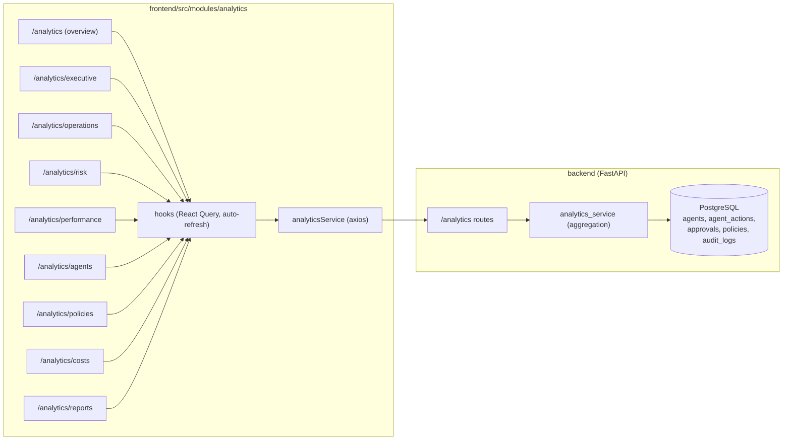

# Phase 3 — Part 3.6: Enterprise Analytics & AI Operations Center

This document records what was delivered in Part 3.6 against the SRS (v0.3.0):
the "mission control" for enterprise AI — executive KPIs, fleet health, risk,
performance, policy, human-review, cost analytics, rule-based insights and a
reports center, in the spirit of Datadog, Grafana Enterprise, Azure Monitor and
a Power BI executive dashboard.

## Design principle: derive + estimate, don't duplicate

Analytics is a read-only projection over the existing operational tables
(`agents`, `agent_actions`, `approvals`, `policies`, `audit_logs`) — no new
tables. Real signals (counts, averages, success/failure rates, approval delays,
risk) are computed from the data. The platform does not record per-action latency
or LLM/compute spend, so those figures are **deterministic estimates** derived
from the real aggregates and flagged with `estimated=true` on the response models
(and a `*` in the UI). Insights are **rule-based** (week-over-week deltas and
leaders) — no LLM.

## Frontend ↔ backend data flow



## Endpoint → UI map

| UI surface | Hook | Endpoint | Permission |
| ---------- | ---- | -------- | ---------- |
| Overview (composite) | `useAnalyticsOverview` | `GET /analytics/overview` | `analytics.view` |
| Executive KPI grid | `useExecutiveDashboard` | `GET /analytics/kpis` | `analytics.view` |
| Activity chart | `useActivity` | `GET /analytics/activity?range=` | `analytics.view` |
| Fleet health | `useFleetHealth` | `GET /analytics/fleet-health` | `analytics.view` |
| Risk dashboard | `useRiskAnalytics` | `GET /analytics/risk` | `analytics.view` |
| Performance dashboard | `usePerformanceAnalytics` | `GET /analytics/performance` | `analytics.view` |
| Policy analytics | `usePolicyAnalytics` | `GET /analytics/policies` | `analytics.view` |
| Human-review analytics | `useHumanReviewAnalytics` | `GET /analytics/review` | `analytics.view` |
| Cost dashboard | `useCostAnalytics` | `GET /analytics/cost` | `analytics.view` |
| AI insights | `useInsights` | `GET /analytics/insights` | `analytics.view` |
| Reports center | `useReports` | `GET /analytics/reports?period=` | `analytics.view` |
| Live activity feed | `useActivityFeed` | `GET /dashboard/recent-actions` | `dashboard.view` |

## Auto-refresh (SRS §Auto Refresh)

| Surface | Interval |
| ------- | -------- |
| Dashboard / overview / fleet | 15s |
| Live activity feed | 10s |
| KPIs | 30s |
| Charts (activity, risk, performance, policy, cost) | 60s |

## RBAC

`analytics.view` gates all analytics surfaces (SUPER_ADMIN, ADMIN, REVIEWER).
`analytics.executive` gates the executive dashboard and `analytics.operations`
gates the operations dashboard — the two tabs are hidden and the pages render an
access-denied state without them (SUPER_ADMIN / ADMIN hold both; REVIEWER holds
operations). VIEWER has no analytics access. The backend enforces `analytics.view`
on every endpoint independently. The backend `UserRole` enum has no AUDITOR /
OPERATOR role, so the SRS's role-based access is implemented with these permission
codes rather than roles.

## Estimated vs measured

| Metric | Source |
| ------ | ------ |
| Counts, success/failure rate, avg risk, fleet health, distribution, heatmap, coverage | measured |
| Approval delay, avg approval time, approval/rejection/escalation ratios | measured |
| Decision latency, policy-eval time, execution time, avg response, retry rate | estimated (from risk/volume) |
| Compute / API / LLM / human-review / policy-eval / storage cost | estimated (unit-rate × volume) |
| False-positive rate | estimated (from trigger effectiveness) |
| Insights | rule-based (week-over-week deltas + leaders) |

## Module structure

```
frontend/src/modules/analytics/
  components/   AnalyticsLayout, RefreshIndicator, KpiGrid, ExecutiveCards,
                FleetHealthPanel, InsightsPanel, ActivityChart, ActivityFeed,
                RiskTrendChart, RiskHeatmap, RiskDistributionChart,
                PerformanceChart, AgentRankingTable, PolicyAnalyticsChart,
                HumanReviewChart, CostBreakdownCard, ReportsPanel, ExportDialog,
                useCountUp
  hooks/        useAnalytics (11 query hooks) + auto-refresh intervals, keys
  pages/        Overview, Executive, Operations, Risk, Performance, Agents,
                Policies, Cost, Reports (+ AnalyticsAccessDenied)
  services/     analyticsService
  types/        index.ts
  utils/        permissions, format, export
  tests/        KpiGrid, panels, utils, fixtures
```

## Backend (added/changed)

- `app/api/routes/analytics.py` — the read-only, RBAC-gated analytics endpoints.
- `app/schemas/analytics.py` — KPI / fleet / activity / risk / performance /
  policy / review / cost / insight / report / overview schemas.
- `app/services/analytics_service.py` — the aggregation engine.
- `app/services/rbac_service.py` — adds `analytics.view` / `analytics.executive`
  / `analytics.operations` permission codes.
- `app/api/router.py` — registers the analytics router.

Backend tests live in `backend/tests/test_analytics_part36.py`; frontend module
tests live in `frontend/src/modules/analytics/tests/`.

> Screenshots (analytics overview, executive, fleet health, risk, performance,
> reports) can be captured from a local `npm run dev` session and dropped into
> `docs/`.
