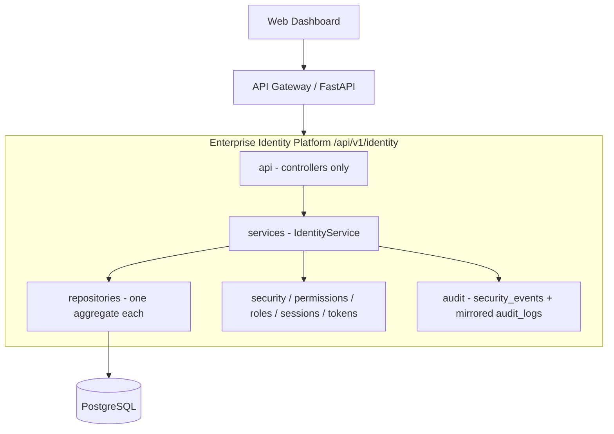
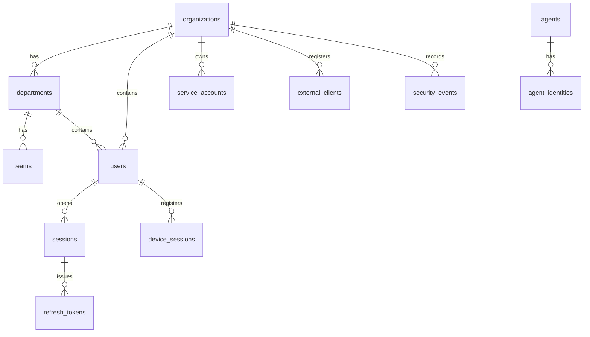

# Phase 4 — Part 4.1: Enterprise Identity Platform Foundation

This document records what was delivered in Part 4.1: a formal **Identity
Foundation** so every human, AI agent, service account, organization and
external application has a consistent identity model, lifecycle and architecture.

## Design decision: additive, not a rewrite

The platform already has `users`, `organizations`, `roles`, `rbac_permissions`,
`role_permissions` and `user_roles` (Phases 1–2). Rather than duplicating them,
the identity foundation **reuses** those tables through repositories and **adds**
the genuinely new identity entities. This keeps all existing behaviour and tests
intact (backend 76/76 green) while establishing the isolated `app/identity`
package the rest of the platform can grow into.

New tables (migration `0006_identity_foundation`): `departments`, `teams`,
`service_accounts`, `external_clients`, `agent_identities`, `sessions`,
`refresh_tokens`, `device_sessions`, `security_events`, plus a nullable
`users.department_id` for the org → department → user hierarchy.

## Architecture (SRS §5, §13)



Strict layering (SRS §13): **controllers → services → repositories → database**.
Controllers never touch the database directly.

## Identity domain model (SRS §7)

| Entity | Table | Notes |
| ------ | ----- | ----- |
| User (human) | `users` (reused) + `department_id` | display_name, role, is_active |
| AI Agent Identity | `agent_identities` | client_id, credential_type, status, expiry |
| Service Account | `service_accounts` | client_secret_hash, permissions, owner, status |
| External Client | `external_clients` | client_id, redirect_uri, secret_hash, allowed_scopes |
| Organization | `organizations` (reused) | tenant boundary |
| Department | `departments` | organization_id, manager_id |
| Team | `teams` | department_id, lead_id |
| Session | `sessions` | user_id, ip, expiry, revoked |
| Refresh Token | `refresh_tokens` | token_hash, rotation chain |
| Device Session | `device_sessions` | device fingerprint, trusted |
| Security Event | `security_events` | actor/target, request/correlation id |

## Database ERD (new entities)



## Identity lifecycle (SRS §8)

```
Created → Pending Verification → Active → Suspended → Disabled → Archived → Deleted
```

Transitions are validated by `IDENTITY_TRANSITIONS` / `can_transition`; every
transition records a `security_events` row (and a mirrored `audit_logs` entry).
Illegal jumps (e.g. `CREATED → DELETED`, or reviving a `DELETED` identity) raise
`IdentityError(INVALID_LIFECYCLE_TRANSITION)`.

## API (SRS §17 versioning, §18 errors)

All endpoints are versioned under **`/api/v1/identity`**:

| Method | Path | Permission |
| ------ | ---- | ---------- |
| GET | `/api/v1/identity/users` | `user.view` |
| POST | `/api/v1/identity/users` | `user.create` |
| GET | `/api/v1/identity/users/{id}` | `user.view` |
| POST | `/api/v1/identity/users/{id}/activate` | `user.create` |
| POST | `/api/v1/identity/users/{id}/suspend` | `user.create` |
| GET | `/api/v1/identity/organizations` | `user.view` |
| GET | `/api/v1/identity/organizations/{id}` | `user.view` |
| GET | `/api/v1/identity/departments` | `user.view` |
| POST | `/api/v1/identity/departments` | `user.create` |
| GET | `/api/v1/identity/departments/{id}` | `user.view` |
| GET | `/api/v1/identity/roles` | `user.view` |
| GET | `/api/v1/identity/sessions?user_id=` | `user.view` |

Every failure returns the standard envelope (SRS §18):

```json
{
  "success": false,
  "error": { "code": "USER_NOT_FOUND", "message": "User does not exist." },
  "request_id": "..."
}
```

The handler is scoped to `IdentityError`, so the rest of the platform's error
format is unchanged.

## Module layout

```
backend/app/identity/
  api/           controllers + versioned router (/api/v1/identity)
  services/      IdentityService (business logic, owns the transaction)
  repositories/  User/Role/Permission/Organization/Department/Session repos
  models/        Department, Team, ServiceAccount, ExternalClient,
                 AgentIdentity, UserSession, RefreshToken, DeviceSession,
                 SecurityEvent, enums (IdentityStatus/Type, CredentialType)
  schemas/       Pydantic request/response + error envelope
  security/      password policy, hashing, secret generation
  permissions/   PermissionEvaluator (facade over rbac_service)
  roles/         RoleEngine (assign/revoke/list)
  sessions/      SessionManager
  tokens/        RefreshTokenService (issue/rotate)
  audit/         record_security_event
  errors.py      IdentityError + envelope + handler registration

frontend/src/modules/identity/
  types, services (axios → /api/v1/identity), hooks (React Query),
  components (IdentityStatusBadge), pages (IdentityPage), utils, tests
```

## Naming standards (SRS §12)

Roles are namespaced (`ROLE_SUPER_ADMIN`, `ROLE_AUDITOR`, …) and permissions are
namespaced dotted codes (`agent.create`, `policy.edit`, `approval.review`,
`audit.export`, `analytics.view`, `user.view`, `user.create`).

## Tests (SRS §20)

```
backend/tests/identity/
  unit/         test_lifecycle.py (transitions + password policy, no DB)
                test_repositories.py (repos + IdentityService + auth, DB)
  integration/  test_identity_api.py (versioning, RBAC, error envelope, request id)
frontend/src/modules/identity/tests/  identity.test.tsx
```

## Performance goals (SRS §21)

Targets: authentication < 150 ms, permission lookup < 50 ms, user lookup
< 100 ms. All identity reads are single-table, indexed lookups; permission
evaluation reuses the existing role→permission resolution.

## Migrations

```bash
cd backend
alembic upgrade head    # applies 0006_identity_foundation
```
